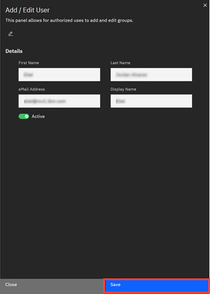

# Adding Users to ID

Adding users to ID includes adding, editing, and viewing users in the ID application.

The following procedure walks through the process of adding users to the ID application.

1.  Click **App Management** in the ID Admin Module menu to open Application Management. Click the The **User View** \(Default\) tab to view the ID users.

2.  Click **Add User** to open the Add/Edit modal.

    

3.  Click the pencil **Add Edit** icon.

4.  Click into the **First Name**, **Last Name**, **Email address** and **Display Name** text fields and enter the requested information.

5.  Move the toggle to **Active**.

6.  Click **Save**.

    The new user is added to Application Management and displays in the **User View** tab with a Status of **Active**.

**Parent topic:**[ID User Management](../../id_docs/admin/user_management.md)

