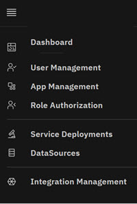

# Admin Console Overview

The Intelligent Design \(ID\) Admin Console is the administrative and configuration center for the ID application environment. Within the Admin Console, Admins define data sources, assign data sources to ID services, deploy ID services, administer and manage ID users, and assign user roles authorization using Groups for each instance of the ID application. Each ID client can have multiple instances of the ID application and Admins use the Admin Console to mange each client's ID application Instance and the client's users within that instance. Administrators use the Admin Console to continually define application features, assign feature access to role-based groups, and create and assign users to the role‑based groups.

**Note:** You must [register and deploy the config-svc service](../installation/config_svc.md) using the **Swagger API** before you can deploy the Admin Console.

The **Admin module** menu provides access to the ID Administration components.

-   User Management - Add, edit, and view individual and Group users configured for each client. Admins can also add ID uses Groups to administer role authorization.
-   Application Management - View features configured for clients and can add, edit, and delete client features. Features are the tools to design, create, and monitor the ID environment.
-   Role Authorization - View Groups and features configured for Groups for each individual client. Admins can add and remove features for individual Groups
-   Service Deployments - Add and View Services and Deployment Status Details
-   DataSources - DataSource Management

## ID, App, and Role Management

**ID User Management**, **App Management**, and **Role Authroization** all work together to provide a seamless experience for ID Users in the ID application.

-   Administrators first use **ID User Management** to add or delete ID users in the ID application, or to add and delete users within to Groups within the application.
-   In the **App Management**, Administrators add and delete features for each client's application.
-   In **Role Authorization**, Administrators can add and delete features within a client Groups.

If a user is resident in a selected Group and features are added to that group, that user automatically inherits the newly added feature.

-   **[ID User Management](../../id_docs/admin/user_management.md)**  
ID Admins use User Management to manage users within the ID Application. Managing users includes adding, editing, and viewing users in each client's application. Admins also use Groups to assign role authorization privileges to users.
-   **[Application Management](../../id_docs/admin/app_management.md)**  
In Application Management, Admins configure each client's ID environment that defines the Features a client's can access. Features are assigned by using Feature keys. Feature Keys are simply another name for configuration actions ID users within that application instance can take. Within each application instance, Features are paired with ID User Role Permissions \(Groups\). For example, the **TechnologyAdd** Feature allows ID Users with the Technology Role Group designation to add Technologies to that client's access.
-   **[Role Authorization](../../id_docs/admin/role_authorization.md)**  
ID Admins use **Role Authorization** to view and customize Groups \(roles\). In the **Role Authorization** module, ID Admins can view existing Group features and add features to any of the Groups. Existing and new Group ID users inherit the existing and added feature capabilities.
-   **[Service Deployments](../../id_docs/admin/service_deployments.md)**  
Admins use **Service Deployments** to register and assign applications for use in Intelligent Design. Applications are registered in the **Serivce View** and their deployments are tracked and modified in the **Deployments View.**
-   **[DataSources](../../id_docs/admin/datasources.md)**  
Data Sources are used in **Service Deployments** when deploying a service. The **DataSources** module enables the Administrator to create and manage these sources.

