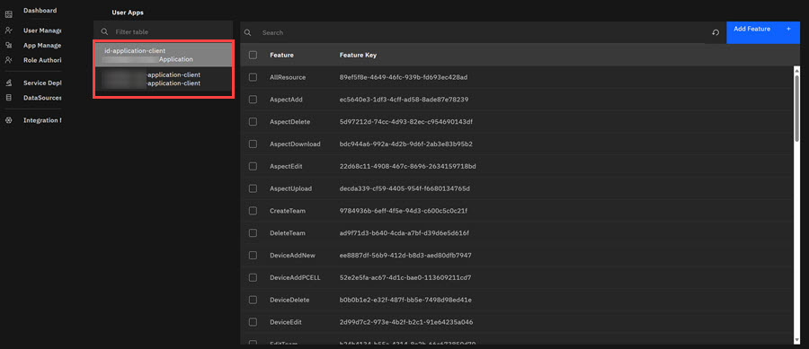

# Application Management

In Application Management, Admins configure each client's ID environment that defines the Features a client's can access. Features are assigned by using Feature keys. Feature Keys are simply another name for configuration actions ID users within that application instance can take. Within each application instance, Features are paired with ID User Role Permissions \(Groups\). For example, the **TechnologyAdd** Feature allows ID Users with the Technology Role Group designation to add Technologies to that client's access.

In Application Management, Admins configure \(add, edit, and enable viewing\) Features that each individual client account can access. Features are paired with ID User Role Permissions \(Groups\). Feature Keys are simply another name for configuration actions ID users within that application instance can take. For example, the Feature Key **TechnologyAdd** is an ID User Permission Action that allows an ID User to add a technology in the ID Application. The [ID User Role Permissions](id_user_role_permissions.md#table_p5v_whp_sfc) table outlines Feature Names \(Keys\) .

1.  Click **App Management** in the ID Admin Module menu to open Application Management page.

2.  Click a client in the drop down menu to view features associated with the client's account.

    

3.  Select **Add Feature** to add a feature for the client. Features are assigned by using Feature Names \(Keys\). The Add/Edit Feature modal opens. See the [ID User Role Permissions](id_user_role_permissions.md#table_p5v_whp_sfc) table to view Feature Names \(Keys\).

    

4.  Click the pencil **Edit Icon**.

5.  Click into the **Feature Key** field and enter a feature key value and then click into the description in the **Decription** text field and enter a description.

6.  Click **Save**.

    The New Feature is added to the Application Management list.

**Parent topic:**[Admin Console Overview](../../id_docs/admin/admin_console_overview.md)

