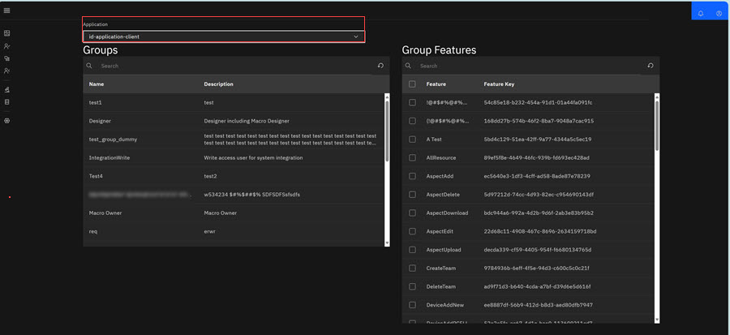
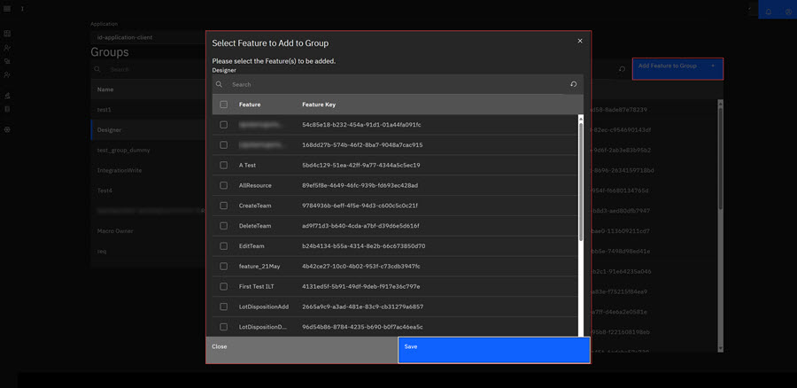
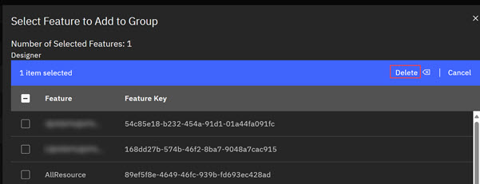

# Role Authorization

ID Admins use **Role Authorization** to view and customize Groups \(roles\). In the **Role Authorization** module, ID Admins can view existing Group features and add features to any of the Groups. Existing and new Group ID users inherit the existing and added feature capabilities.

Application management and role authorization work together in the ID application. In Application management Admins define which features are available in each ID client application instance. Accessing Features in each ID instance is controlled by ID User Permissions \(Groups\). If an Admin configures Features in a client instance, a specific Group must be defined for the Feature so that ID Users in the specific Group can access the Feature. The following procedure walks through the process of adding features to Groups. In Application Management, Admins configure each client's ID environment that defines the Features a client's can access. Features are assigned by using Feature keys. Feature Keys are simply another name for configuration actions ID users within that application instance can take. Within each application instance, Features are paired with ID User Role Permissions \(Groups\). See ID User Role Permissions

1.  Click **Role Authorization** in the ID Admin Module menu to open Application Management page.

2.  Click a client in the drop down menu to view Groups and Group features associated with the client account. In the [ID User Role Permissions](id_user_role_permissions.md#table_p5v_whp_sfc) table, Groups are listed as Target Entities. Target Entities are **Project Administrator**, **Macro Owner**, **Designer**, **Tester**, and **PTC Admin**.

    

3.  Click the **Group** where you want to add features.

4.  Click **Add Features to Group**. The **Select Feature to Add to Group** modal opens.

    

5.  Click the check box for each features you want to add.

    **Note:** Add a feature and delete a feature are two separate actions and you must perform these actions separately.

6.  Click **Save**. A system prompts displays **Successfully Saved**. The newly added feature is added to the Group. Alternatively, you can click the checkbox for a feature and click **Delete** to delete a feature.

    

**Parent topic:**[Admin Console Overview](../../id_docs/admin/admin_console_overview.md)

