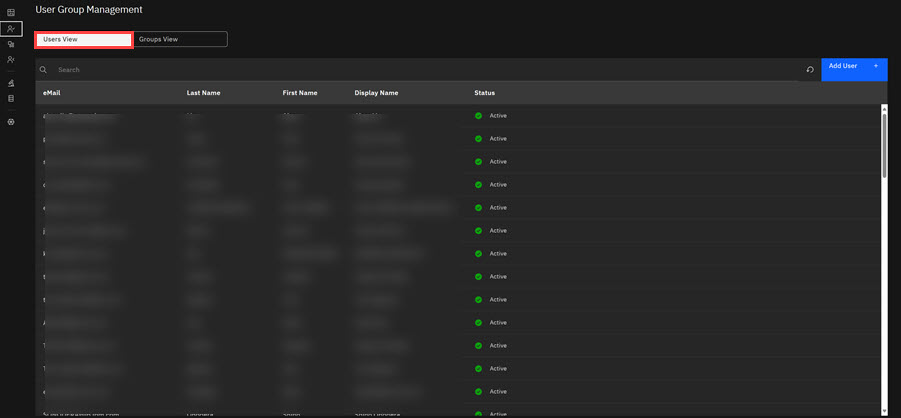
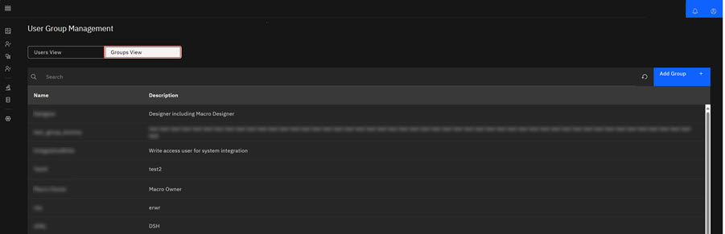

# ID User Management

ID Admins use User Management to manage users within the ID Application. Managing users includes adding, editing, and viewing users in each client's application. Admins also use Groups to assign role authorization privileges to users.

In ID User Management, Admins can add, edit, and view users in the client's applications. The following procedure demonstrates how to add and view users in User Management.

1.  Click **App Management** in the ID Admin Module menu to open Application Management. The App Management landing page offers two distinct views: **User View** \(Default\) and **Groups View**.

2.  Click the **User View** tab to view a list of Groups/User across all the applications. The list includes each user's email address, Last Name, First Name, Display Name, and Status \(Active and Inactive\).

    

3.  Click the **Groups View** to view a list of Groups within this application.

    

-   **[Adding Users to ID](../../id_docs/admin/adding_users_to_intelligent_design.md)**  
Adding users to ID includes adding, editing, and viewing users in the ID application.
-   **[Adding Users to Groups in ID](../../id_docs/admin/adding_users_to_groups_in_intelligent_design.md)**  
Authorization roles \(User Roles\) are categorized in ID by using Groups. Each Group is assigned a role authorization and corresponding features for that role. For example, the Designer User Role \(Group\) can create, edit and delete Macros and Groups. The Designer group contains users and features a Designer needs to fulfill their responsibility. When a new user is assigned to a Designer group, that user inherits the Designer role authorization and features.
-   **[ID User Role Permissions](../../id_docs/admin/id_user_role_permissions.md)**  
In the Intelligent Design application, user roles define user permissions. Each user has a defined set of permissions that allow or restrict the configuration actions an ID user can take.

**Parent topic:**[Admin Console Overview](../../id_docs/admin/admin_console_overview.md)

