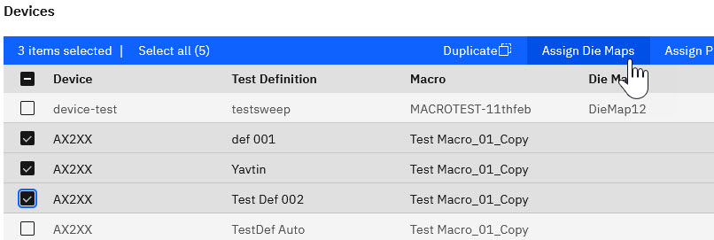
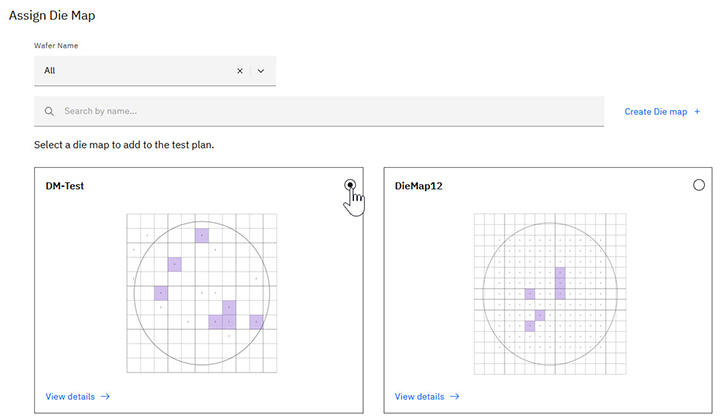

# Assigning die maps to devices

You can assign a die map to a single device, or assign the same die map to multiple devices.

The Device Management steps covered in this task are part of creating or editing a Test Plan.

1.  To assign a die map, perform one of the following actions in the Test Plan Create/Edit window:

    -   Click the **More** menu in the row for the device you want to update, select **Edit**, then click **Assign a die map**.

        

    -   Select one or more Device\(s\) you want to update, and click **Assign Die Maps**.

        

2.  Select a Wafer Name to filter the die maps, or search for a die map by name.

    **Tip:** You can also click **Create Die map** to [create a new die map on the fly](create_die_map_on_the_fly.md).

3.  Select the die map you want to assign to your device\(s\), and click **Assign**.

    

**Parent topic:**[Managing Devices in Test Plans](../id_docs/tesplandevices.md)

**Related information**  

[Die Mapping](die_mapping.md)

