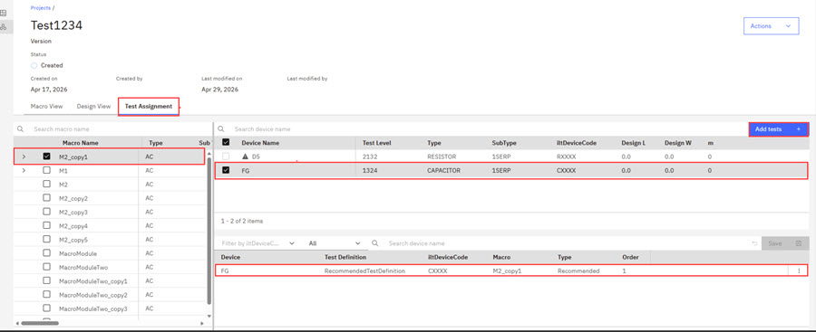

# Associating a Test Assignment to a Testsite Macro

**Macro Owners** create **Test Assignments** to request specific tests \(test definitions\) to be executed on a given device. When there are Test Assignments available, a Test Engineer can **Apply** these specific test assignments when creating a Test Plan. This procedure helps ensure that the Macro Owner’s testing intent is followed accurately. In summary, macro owners create Test Assignments for Testsite macros that are sent to Intelligent Test where Test Engineers can apply them in the creation of a test plan.

**Note:** Only macro owners can assign test assignments on Testsite macros they own. Macro owners can assign, edit, reorder, and save test assignments for Testsite macros and devices they own. Test Assignments are available only for Testsite Macros.

1.  Browse to the project that holds the macro you own. open the macro that you own to assign a device and a test assignment to the macro.

2.  Click **Macro View** to view your Testsite macros.

3.  Click **Design View** on the Macro Creation view to view your **Devices**.

4.  Click the **Test Assignment** tab and select a Testsite macro.

5.  Click a **Device** to associate the device with the selected Testsite macro.

6.  Click a **Test Assignment** to associate the Test Assignment with your device and then click **Add Tests** to add the **Test Assignment** to the device.

    

    To learn more about how Testers use Test Assignments during Test Plan configuration, see [Managing Devices in Test Plans](tesplandevices.md).

**Parent topic:**[Creating Macros](../id_docs/creating_macros.md)

