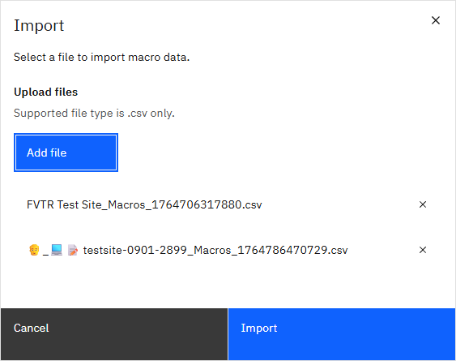
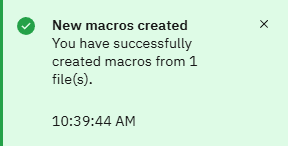

# Creating multiple groups

Project administrators can create multiple Groups simultaneously, reducing manual effort and ensuring consistency.

Multiple groups can be created by uploading CSV files containing macro information. Each CSV must contain information on exactly 2 or 4 Macros, and must contain the location data for each macro in the group.

1.  When on a project page, click the **Upload ** button. This opens the Import modal.

2.  On the Import modal, click **Add file** and select a .CSV file to upload. Multiple Groups can be added to the import.

3.  Click Import. The Modal will close and a message indicating the success or failure of the import will appear.

    Each .csv file must contain information for exactly 2 or 4 Macros, including their position within the group, or the import will fail with an error. If an identical group already exists or multiple copies of the same group are imported at once, the import of that group will fail and an error message will appear.

**Parent topic:**[Grouping Macros](../id_docs/grouping_macros.md)

