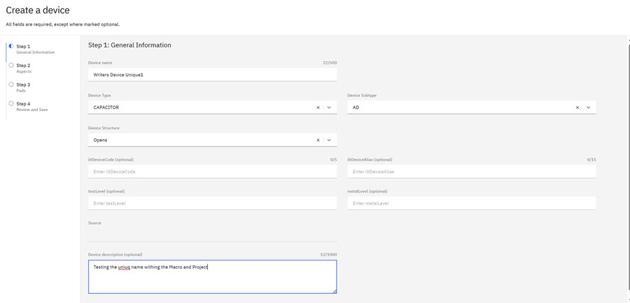
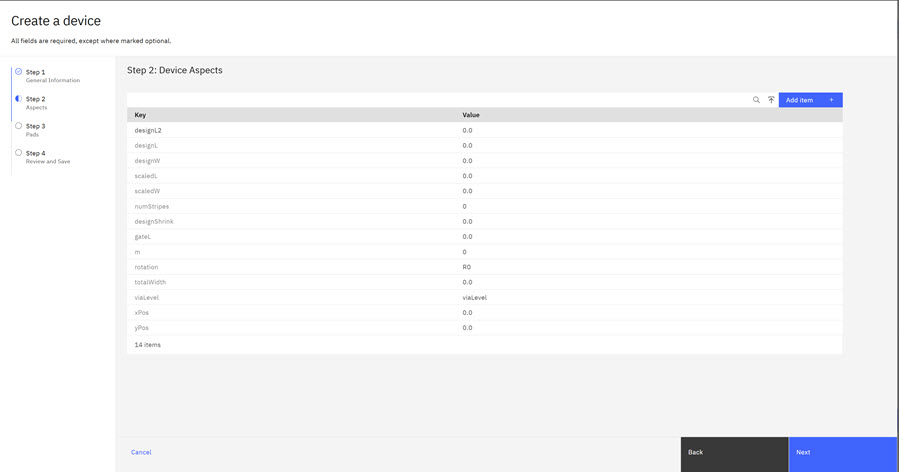
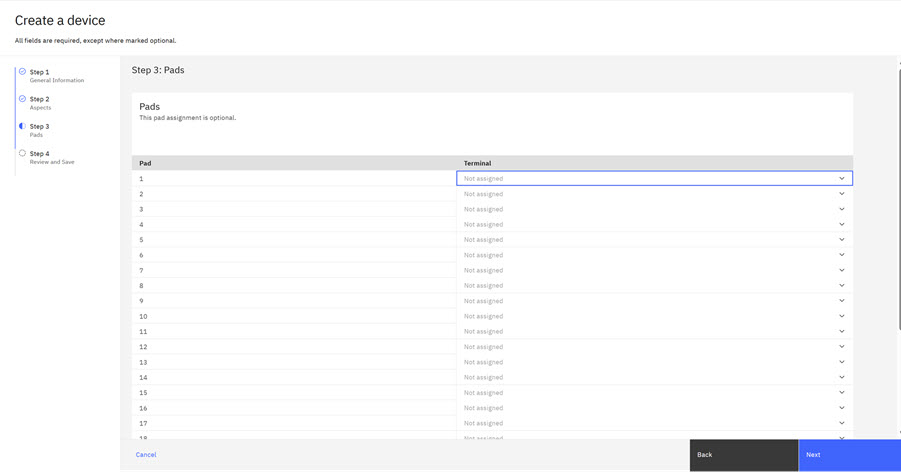
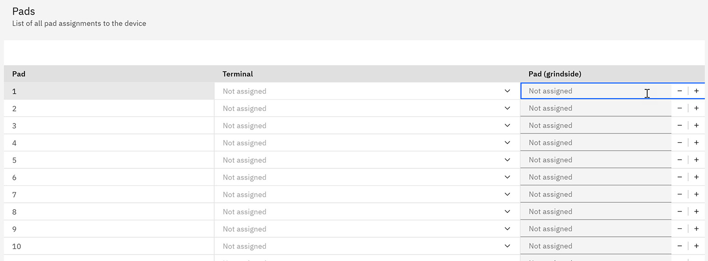
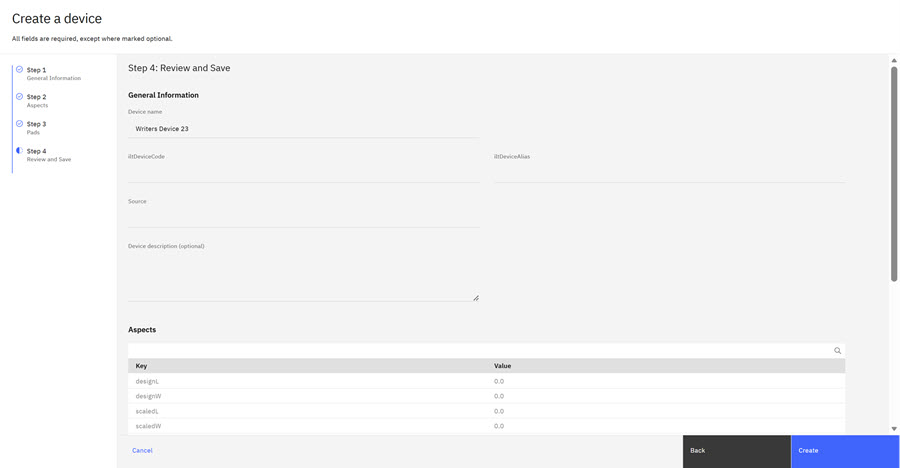
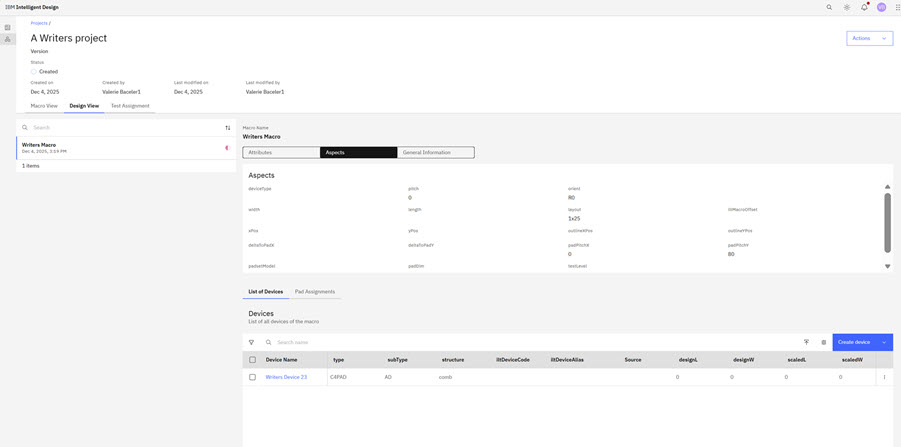

# Creating a Device

A device in Intelligent Design refers to a core technology area within a macro layout. Each device represents a Device Under Test \(DUT\) in the layout and contains the parametric specifications if designed through automation. Device names must be **unique** within each project.

**Device naming conventions**:

-   Require that device names must be **unique** wihtin each project. The system checks for duplicate device names within a project and prevents the creation of a new device with a name that exists within that project
-   Device names can be duplicated across different projects, but the device name must be unique within each project
-   User error messages display if users attempt to create a new device with a name that already exists within the project
-   To create a Device, users must be on the **Design View** tab in a Project, and must be viewing the Device List

1.  On the **Design View** tab, click **Create Device** \> **Create new**. The Create a Device Step 1 modal opens.

    

    Complete the fields in the Step 1 Modal:

    |Attribute|Description|
    |---------|-----------|
    |**Device Name**|Name of the device.|
    |**Device Type**|Type of device.|
    |**Device Subtype**|Subtype of type for categorization.|
    |**Device Structure**|Description of device wiring/position.|
    |**iltDeviceCode**|ILT Device code.|
    |**iltDeviceAlias**|ILT Device alias - ilt device type+macro alias+device position.|
    |**Test Level**|Levels the device is testable at.|
    |**Metal Level**|Metal level device first becomes testable.|
    |**Source**|Source of the device definition if PCELL sourced.|
    |**Device Description**|Optional description of the device.|

2.  Click **Next**. The Create a Device Step 2 modal opens.

    

    |Aspect|Description|Default value|
    |------|-----------|-------------|
    |**designL**|Design length in microns \(replaces length\).|0.0|
    |**designW**|Design width in microns \(replaces width\).|0.0|
    |**scaledL**|The on-wafer, mask length.|0.0|
    |**scaledW**|The on-wafer, mask width.|0.0|
    |**numStripes**|Represents product of m\*nX\*nY.|0|
    |**designShrink**|Ratio of designL/W to scaledL/W.|0.0|
    |**gateL**|Indicator for whether inline tests use scaledL or designL or some value for current scaling.|0.0|
    |**m**|Multiplicity of devices.|0|
    |**rotation**|Common pcell aspect describing how device is rotated.|R0|
    |**totalWidth**|Total width of device.|N/A|
    |**viaLevel**|via level device becomes available.|viaLevel|
    |**xPos**|X position of device within macro.|N/A|
    |**yPos**|Y position of device within macro.|N/A|

    Click the Key for each Aspects you want to add and then click **Add Item**. Click **Next** when your choices are complete. The Create a Device Step 3 modal opens.

    

    Select the **Pad Assignments** that you want to use in your testing. Pad Assignments selection is optional.

    **Note:** If the value of **ILT3D** is set to **Both**, the Device displays both Frontside and Grindside pad-to-terminal mappings side by side.

    If no frontside mapping is provided for a pad, the grindside field for that pad remains unpopulated. The system does not auto-fill missing grindside mappings you must enter grindside pad numbers manually.

    

3.  Click **Next**. The Review and Save modal opens.

    

    Review the device configurations. If you want to make changes, click **Back** to make changes.

4.  Click **Create** to create the device. The newly created device displays in the **Design View** of your project.

    

    **Note:** Devices are created under a specific Macro and can be used only for the Macro they are created under.

**Parent topic:**[Devices](../id_docs/id_devices.md)

