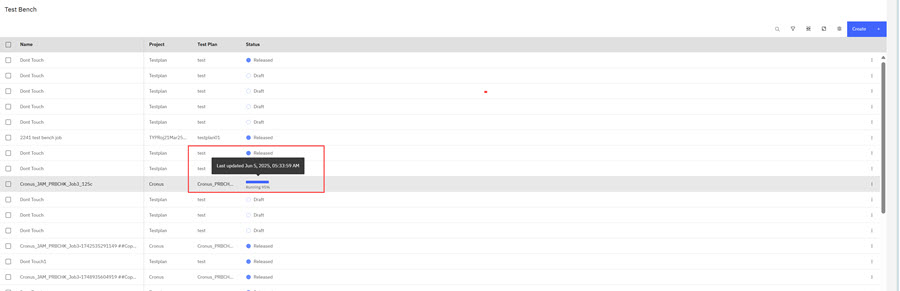

# Creating a Test Bench Job

The IT and TestBench \(TB\) tool integration is a seamless process where Test Plans configured in IT are sent to the TestBench tool for execution.

During test execution in TestBench, results are returned to IT in real time to the IT Test Bench table. The status column in the table displays the percentage complete for each test with an accompanying timestamp. Upon test completion, the status changes to complete.

Use these steps to browse to the TestBench page.

-   From the Intelligent Design app, click the **Switcher** icon and select **Intelligent Test**.
-   Browse to the Test Plan page and click **Test Bench** from the navigation menu.

The TestBench table displays IT Test Plans presently being tested in the TestBench application. Any TestBench jobs assigned to a project that the user belongs to will appear in the list. Any jobs that are part of projects which are not assigned to the user's team, or projects that are not visible to the user due to role permissions, will not be visible to that user.

**Note:** Icons on the **Test Bench** table header row provide access to the following controls.

|Icon|Description|
|----|-----------|
|Search|Click **Search** to open the search field to enter a search operator.|
|Filter|Click this icon to open the Data Filter modal. Use the **Key**, **Operator**, and **Value** filter options to search the TestBench table. **Key** options are: name, status, createdBy, createdDate, lastModifiedBy, lastModifiedDate. **Operator** filter options are: Equal, Not Equal, Greater Than, Greater Than and Equal, Less Than, Less than and Equal, Like, and In. **Value** options are user defined. Click **Apply** to initiate the search.|
|Compress|Click to compress the table columns.|
|Maximize|Click to maximize the table.|
|Customize Column|Click to open the Manage Column modal to add, delete, or reorder the columns display. Click **Save** to save your changes.|

**Note:** Only Testers can create, edit, delete, or upload Test Plans.

1.  Click **Test Bench** in the left navigational pane. The Test Bench page opens and displays the TestBench jobs table. Default TestBench job column identifiers are:

    -   Name
    -   Project
    -   Test Plan Name
    -   Status
    **Name** is the unique name that is assigned to the particular TestBench Job, **Project** can be a Testsite Project or a Kerf Project, **Test Plan Name** is the plan that is configured in IT to be executed in the TestBench Job, and the **Status** is the present status of the TestPlan.

    **Note:** Only users who are on teams assigned to the project that is referenced in a TestBench job can view, edit, delete, or download that TestBench job.

    **Note:** If the Customize Column feature has added table columns, the table displays the additional customized columns.

2.  Click the **Create** control or click **Create Test Bench** in the user interface if available. The Create a Test Bench modal opens.

3.  Complete the following fields for your Test Bench job in the Create a Modal. Description and Test Cell are optional fields. Drop down arrows on the field indicate a selection list; use it to select a value.

    **Note:** The Lot ID field is a dependent drop down selector. When a Lot ID is selected, the wafer ID drop down presents Wafer IDs contained in the selected Lot ID.

    -   Project
    -   Description \(optional\)
    -   Technology - Use the down arrow to select an available Technology
    -   Project
    -   Lot ID
    -   Wafer ID
    -   Test \(or Build\) Level
    -   Test Plan
    -   Lab
    -   Test Cell \(Optional\)
    -   Temperature
    -   Additional Information
    |Field|Description|
    |-----|-----------|
    |Name|Enter a name for the IT Test Plan. \(Character limit of 500.\)|
    |Description|Enter a description for the IT Test Plan. \(Character limit of 1,000.\)|
    |Technology|Use the drop-down arrow to select a technology.|
    |Project|Select an appropriate project. Only projects a user is authorized to view are available.|
    |Lot ID|Enter the Lot ID. \(Character limit of 500.\)     -   Lot ID: 25YTYCXB004.003
|
    |Wafer ID|Enter the Wafer ID. Use comma separators to enter multiple WaferIDs. \(Character limit of 500.\)     -   TESTWAFERID1, TESTWAFERID2, TESTWAFERID3
|
    |Test Level|Use the drop down to select a value.|
    |Test Plan|Use the drop down to select the Test Plan. Only Test plans a user is authorized to view are available.|
    |Lab|Use the drop down to select a value.|
    |Test Cell \(Optional\)|Click **Add Test Cell**. In the new window, select a test cell to see the list of instruments for that cell. Select the test cell that has the required instruments to run your test plan, and click **Add**.|
    |Temperature|Enter the temperature value in Celsius. The temperature range is -40 to 340.|
    |Additional Information \(Optional\)|Enter additional information. \(Character limit of 1,000.\)|

4.  Click **Create**. The Job Status changes to **Draft**. In **Draft** status the TestBench job can be edited or deleted.

5.  Click **View** TestBench to view Job \(Test\) results when the job status is in **Released** status. Test results are viewable and downloadable during test execution and upon test completion. Format of downloads is a JSON message of an array of test results that are received to the time of download.

6.  **Click** the vertical ellipsis to select **Submit** to submit the TestBench Job to TestBench for execution. The Test Bench Status changes to **Released**. As test results generate, results are returned to IT in real time to the status column with the percentage complete for each test with an accompanying timestamp. Upon test completion, the status changes to complete.

    

    Clicking the vertical ellipsis for a TestBench test displays a set of options that are tailored to the status of each TestBench job. See the following table.

    |TestBench Job Statuses|Click **Vertical Ellipsis** \(Overflow Icon\) to Access Options|
    |----------------------|---------------------------------------------------------------|
    |Released|Released status occurs on submittal TestBench of Jobs.|View|
    |Draft|User has option to resubmit adding the following characters to the name **\#\#COPY:<sequencenumber here\>**. If the test plan is already a copy, the user can increment the sequence number.|    -   Edit
    -   Delete
    -   Submit
|
    |Running|The **Running** status displays returns results in real time with the percentage complete for each job and a timestamp. Hovering over the percentage complete, Upon test completion, the status changes to complete.|    -   View
    -   Download Results
|
    |Aborted|User has option to resubmit adding the following characters to the name **\#\#COPY:<sequencenumber here\>**. If the test job is already a copy, the user can increment the sequence number.|    -   View
    -   Download Results
    -   Resubmit
|
    |Completed|User has option to resubmit adding the following characters to the name **\#\#COPY:<sequencenumber here\>**. If the test job is already a copy, the user can increment the sequence number.|    -   View
    -   Download Results
    -   Resubmit
|

**Parent topic:**[Test Bench](../id_docs/test_bench.md)

