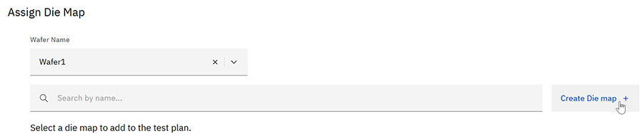

# Creating a die map on the fly

You can create a Die Map as part of the process of assigning die maps to devices.

1.  On the [Assign a Die Map](assign_die_maps.md) page, select a **Wafer Name**, and click **Create Die map**.

    

2.  On the Create a die map page, the map can be defined via JSON upload, or manual definition.

3.  To create the map via upload, click **Upload**. Select a properly formatted die map JSON file and click open. The die map will be automatically filled in with details from the JSON files, but these can still be edited.

4.  To create the wafer by manual entry, enter a **Name** for the map, along with a description. After these have been done, click **Next**.

5.  On the Die map layout page, you can select the active die by checking the box next to their listing in the Die Map chart, or by clicking the die on the **Wafer Map**. When a die is selected, it is highlighted on both the chart and the map.

6.  After selecting the active die to make the map, click **Create die map**.

    The die map is created and you are returned to the Assign Die Map window.

**Parent topic:**[Managing Devices in Test Plans](../id_docs/tesplandevices.md)

