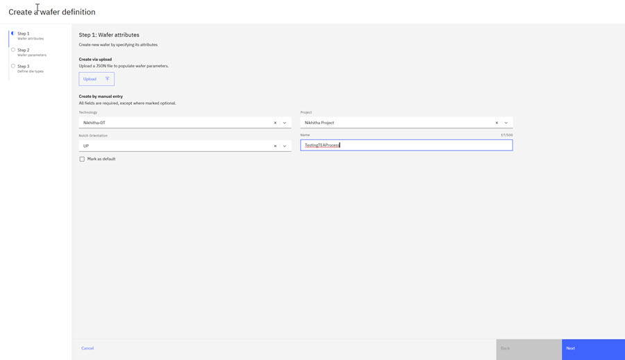
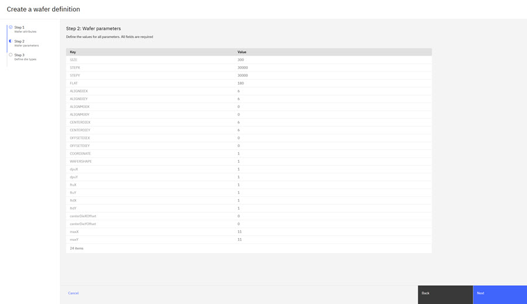
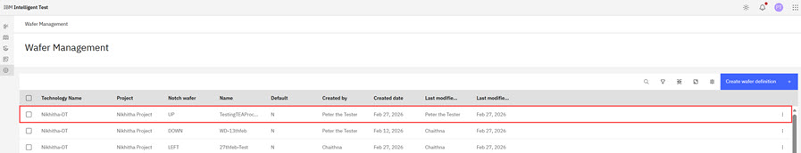

# Creating a Wafer Definition

You can create a Wafer Definition on the Wafer Management page of the Intelligent Test app.

To navigate to the Wafer Management page:

-   From the Intelligent Design app, click the **Switcher** icon and select **Intelligent Test**. On the left side of the Intelligent Test page, click **Wafer Management**. The Wafer Management page opens.

1.  On the Wafer Management page, click **Create wafer definition**.

    

2.  On the Create a wafer definition page, the wafer can be defined by using a JSON upload using the **Upload** control, or by using manual definition.

3.  To create the wafer using upload, click **Upload**. Select a properly formatted Wafer JSON file and click open. The wafer definition is automatically filled in with details from the JSON files, but these can still be edited.

4.  To create the wafer by manual entry, select a **Technology** for the wafer. Once a technology is selected an associated **Project** can also be selected.

    **Note:** Only users who are on teams assigned to the project that is referenced in a Wafer Definition can view, edit, delete, or download that Wafer Definition.

5.  Set the Wafer's **Notch Orientation** and **Name**.

6.  Define the wafer definition as a default by checking the checkbox. After these have been done, click **Next**.

    The Create a Wafer - Step 2 modal opens.

    

7.  On the Wafer Parameters page, set the 22 Wafer parameters, such as Size, StepX, StepY, Flat, Wafershape, etc. Click each parameter's value field to open that field for editing. Once all fields have been entered correctly, click **Next**.

    The Create a Wafer - Step 3 modal opens.

    

8.  On the Define die types page, the die chart can be used to set the die type for each die. This can be done one by selecting **N for None**, **F for Full**, **P for Partial**, or **E for Edge** in each die's drop down. Individual dies can also be set by clicking them on the **Wafer Map** to open up the Assign die type dialog.

9.  Die types can also be set in groups or in bulk. To assign them in a group, check the box for each die to define, then click **Assign** at the top of the die chart. To assign the die type for all dies at once, check the box at the top of the die chart so it shows a checkmark, and click **Assign**. Both methods open the Assign die type window.

10. The Assign die type window shows the number of die currently selected to have their type assigned. Using the drop-down, select **None**, **Full**, **Partial**, or **Edge**, then click **Apply**. All selected dies change to the selected type.

11. After selecting the appropriate die type for the wafer map, clicking **Create** creates the new Wafer definition and navigates to the Wafer management main page. The Wafer Management screen shows the newly created Wafer Definition. Click the Ellipsis for the Wafer Definition listing to view options, Edit, Download, Delete.

    

**Parent topic:**[Wafer Management](../id_docs/wafer_management.md)

