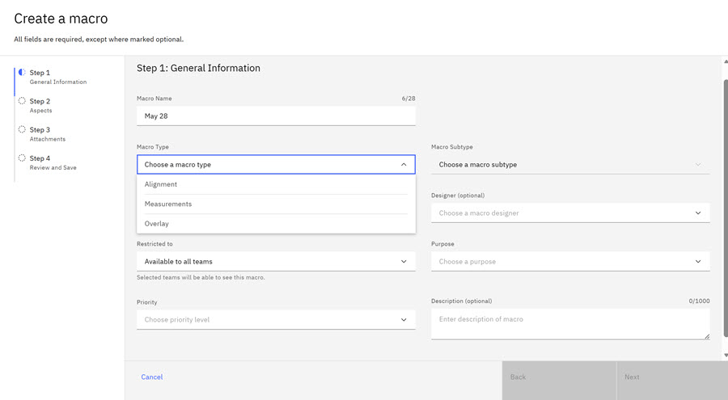
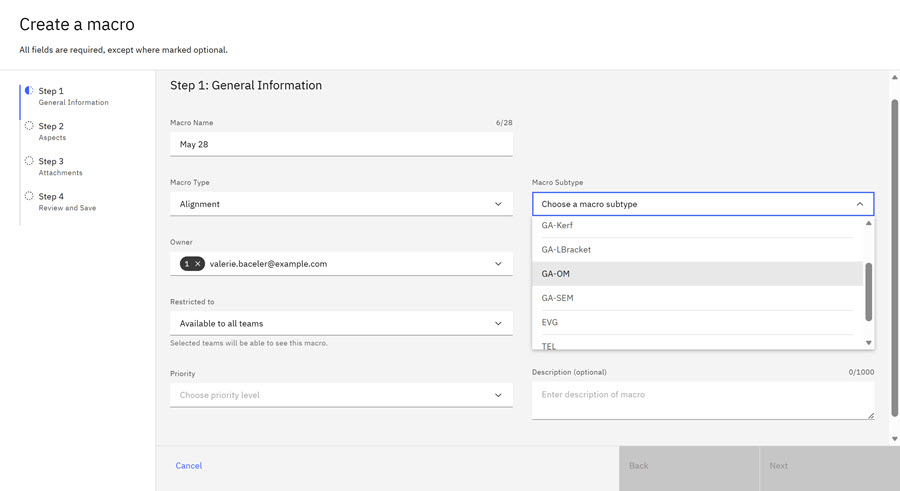
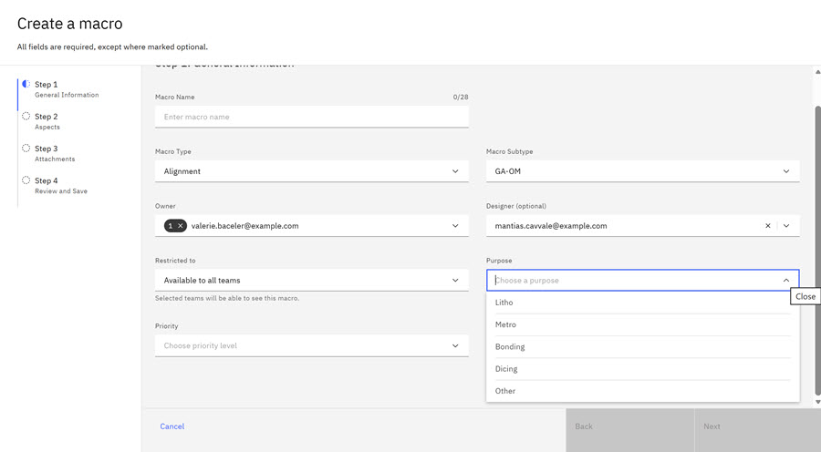
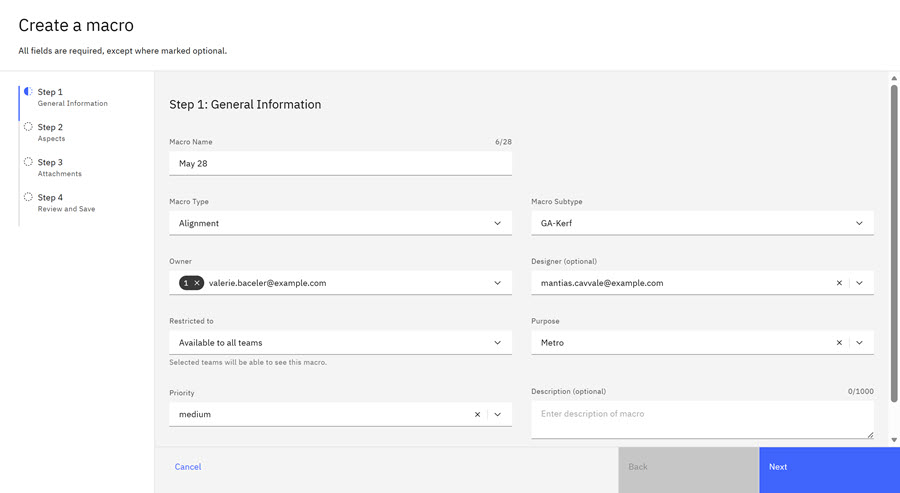
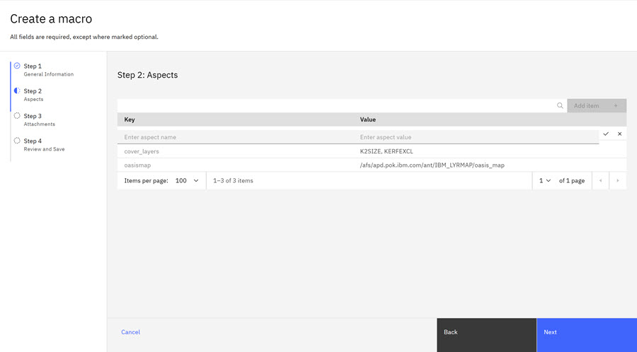
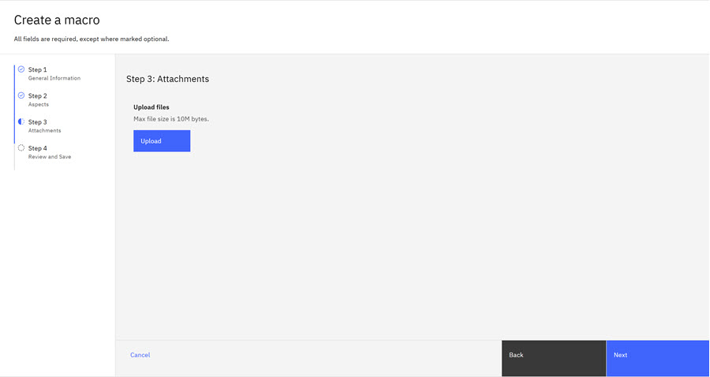
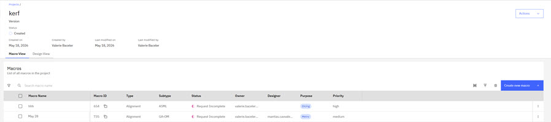

# Creating Macros - KERF

Macro Owners can create Macros in the ID application.

When you log in to the ID Application, the application recognizes your user permission level and opens the corresponding User Interface \(UI\) page. Macro Owners land on the Project page, where they can view existing Projects and create new macros within those Projects.

1.  Click the **Project** tab and click a KERF Project Name.

    The KERF Project page opens and displays two tabs, the **Macro View** and **Design View**.

    

2.  Click **Macro View**.

3.  Click **Create New Macro**.

    The Create New Modal opens. Step 1, General Information, opens.

    

4.  Complete the Macro Name field. Click the drop down arrow on the Macro Type and select a Macro Type: Alignments, Measurements, or Overlay. In this example, **Alignment** is selected. When you select a Macro Type, the values in the **Macro Subtype** drop-down re-adjust and align with the Macro Type choice.

5.  Click the drop down arrow on the Macro subtype and select a Macro subtype from the multiple options. In this example, the **GA-OM** subtype is selected.

    

6.  Select the Macro Owner, Designer, and Restriction value. Restriction values choice is **Available all teams** or **ALLROLES\_team**.

    

7.  Click the drop down arrow for Purpose and select a Purpose. In this example, **Metro** is selected.

    

8.  Click the drop down for Priority and select a priority level. Enter a description in the Description text box.

9.  Click **Next**.

10. The Create New Modal opens. Step 2, Aspects, opens. Complete aspects and click **Next**.

    

11. The Attachments Modal Step 3, opens. Click **Upload** to upload attachments. Click **Next**.

    

    The Review Page opens for your review.

    

12. Click **Create** if you are satisfied with the Macro. The newly created Macro displays in the Macro View of the Project.

    

**Parent topic:**[Macros](../id_docs/macros.md)

