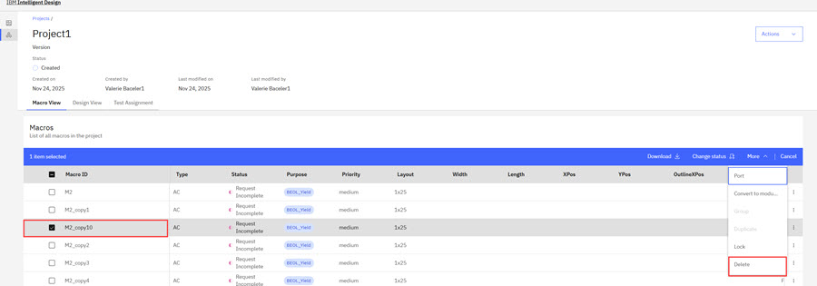
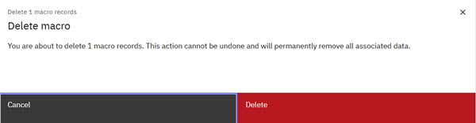

# Deleting a macro

Macro owners can delete macros that they own. Deletion is a two-step process and each individual deletion must be confirmed. Deleting macros cannot be undone and removes all associated macro data.

INTED-2803 Acceptance Criteria Deletion Rules:

**Deletion Rules**

**Clones**

-   Individual clones can be deleted without affecting other clones or the parent.
-   Deleting the parent macro automatically delete all clones.

**Group - Deleting a Group Child**

-   Removes the child macro
-   Removes the group parent
-   Ungroups and reverts macros to independent states

**Deleting the Group Parent**

-   Ungroups and reverts macros to independent states

**Modules**

-   Deleting a child module removes all child modules \(reverts macro back to core macro\)
-   Deleting a parent module deletes the macro and all children

1.  As a Project Admin, log in to Intelligent Design and click the **Project** tab.

2.  Click the **Project Name** you own and browse to the **Macro View** tab.

3.  Click the checkboxes for the macros you want to delete.

    

4.  Click **More** on the menu bar tab and scroll to the **Delete** action. Click **Delete**. The ID system responds with a warning that the deletion is final and cannot be reversed.

    

5.  Click **Delete** to confirm the deletion or **Cancel** to cancel the deletion.

**Parent topic:**[Macros](../id_docs/macros.md)

