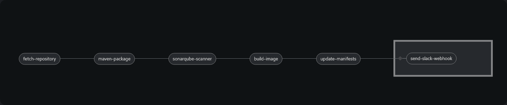
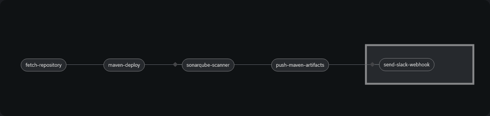
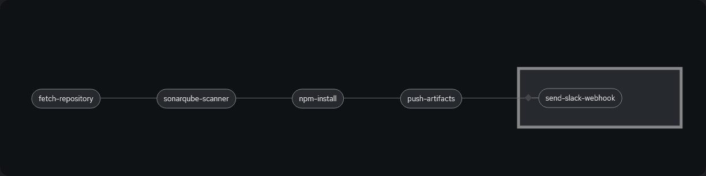
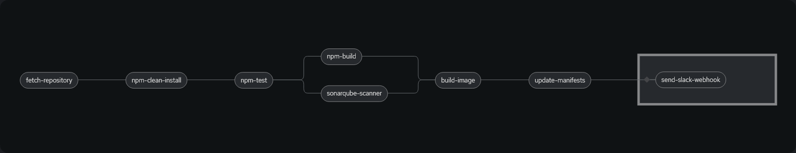
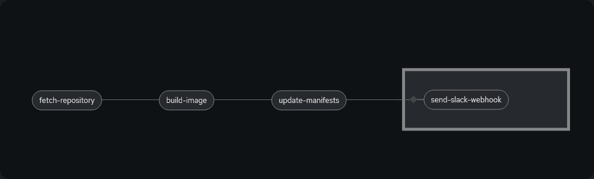

# Custom Pipelines

The Intelligent Design development Pipelines are build on Tekton \(OpenShift Pipelines implementation\). Depending on the source code and format there are several currently implemented pipelines which can build and deploy code.

**Java**

-   java-build-package - builds Java application code and packages into a container

    

-   mvn-deploy-script - builds Java code \(libraries\) and POMs, uploads to GitHub repository

    

****

-   nodejs-build-libs - builds NodeJS libraries and uploads to GitHub repository

    

-   nodejs-build-package - builds NodeJS web application code and packages into a container

    

**Generic**

-   build-container - builds a customized image from a Dockerfile, no special pre or post-processing

    

