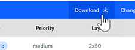
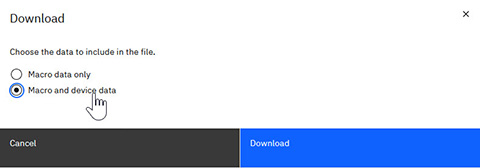

# Downloading Macros and Devices

You can download multiple macros and all associated devices, including all attributes and aspects, in .csv file format.

**Note:** The macro export function now includes complete grindside data for macros with **ILT3D** designated as **Both**. The downloaded file includes both frontside and grindside data.

-   Grindside aspects \(all 5 fields\) and pad-terminal information are included in the export.
-   Grindside data follows the same structure and naming conventions as frontside data.

1.  On the **Macro View** tab, select one or more Macros in the table that you want to download.

2.  Click **Download**.

    

3.  Select one of the following options:

    -   Macro data only
    -   Macro and device data: This option also includes macro aspects, device aspects, and pad assignments
    

4.  Click **Download**.

    The Macro is saved as a .csv file to your download location.

    **Note:** Only business-relevant attributes and aspects are included in the downloaded macro. No system-generated fields, such as unique IDs, internal identifiers, and system-related metadata are included.

**Parent topic:**[Macros](../id_docs/macros.md)

