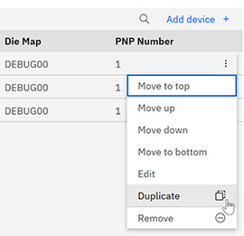
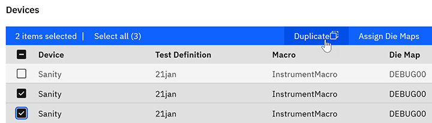
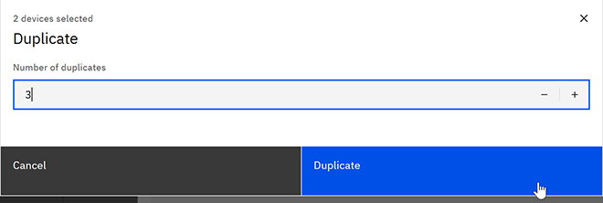

# Duplicating test tasks in a test plan

Testers can duplicate one or multiple test tasks within the test plan creation interface to save time and effort when creating test plans.

**Note:** Users who are on teams that are assigned to the project that is referenced in a Test Plan are the only ones who can view, edit, delete, export, import, or archive the Test Plan.

1.  To duplicate one or more test tasks when creating or editing a test plan, scroll to the **Devices** list, and do one of the following:

    -   Click the **More** menu in the row of a single device, and select **Duplicate**.
    -   Select one or more Devices from the table, and click **Duplicate** at the top of the table.
    

    

2.  Enter the number of duplicates you want to create of each task, and click **Duplicate**.

    

3.  Click **Save**.

**Parent topic:**[Test Plan](../id_docs/it_test_plan_intro.md)

