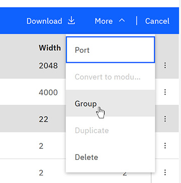
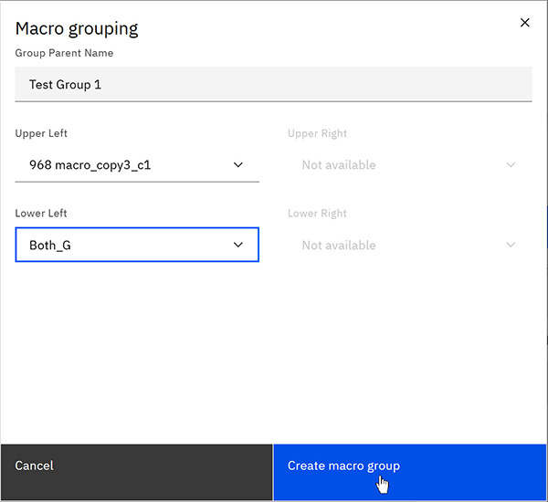

# Grouping Macros

Macro owners and Project Administrators can create macro groups containing 2 or 4 macros.

**Note:** Only Macro Owner and Project Administrator roles can create macro groups. Each group must consist of exactly 2 or 4 macros.

1.  Select the **Project** tab where you created your macros.

    The **Project** page opens and displays two tabs, the **Design View** and **Macro View**.

2.  On the **Macro** View, scroll to the Macros that you created.

3.  Click the check boxes next to 2 or 4 Macro names that you want to include in a group.

4.  Click **More** and then click **Group** in the menu bar.

    

5.  On the Macro grouping window, type a unique **Group Parent Name**.

6.  For a 4-macro group, select each macro for Upper Left, Upper Right, Lower Left, Lower Right.

    For a 2-macro group, select only Upper Left and Lower Left \(others are disabled\).

7.  Click **Create macro group**.

    A system notification confirms that your Macros were ported to your selected project.

-   **[Creating multiple groups](../id_docs/bulk_grouping.md)**  
Project administrators can create multiple Groups simultaneously, reducing manual effort and ensuring consistency.
-   **[Ungrouping macros](../id_docs/ungroup_macros.md)**  
If needed, Macro groups can be broken up while keeping the macros that made up the group available in the project.

**Parent topic:**[Macros](../id_docs/macros.md)

