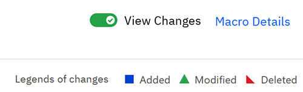
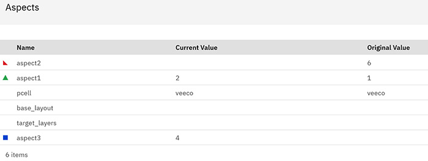

# Viewing changes in a Macro

You can view changed values in any Macro with a status of **Request Complete** or beyond.

This feature lets you easily identify what has been modified after the request was finalized, ensuring traceability and review efficiency.

**Note:** You can view changes only for Macros with **Request Complete** or later status.

1.  On the **Design View** tab, select a Macro with a **Status** of **Request Complete** or beyond.

2.  Click a **Target Name** or **Device Name** in the list.

3.  Toggle the **View Changes** switch to on.

    

    A column is added to show the previous value of any item that was changed, compared to the current value, and deleted items appear in the table. Changed values are marked with the following indicators of how they were changed.

        ||Added|
    ||Modified|
    ||Deleted|

    

**Parent topic:**[Macros](../id_docs/macros.md)

