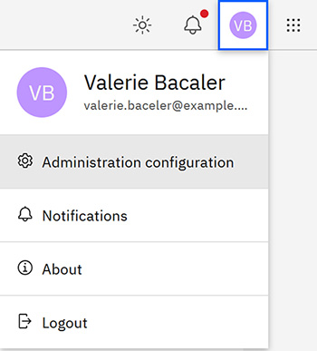

# Administration Configuration

To access the Administration Configuration page and perform Project Administrator tasks, click your profile icon, then select **Administration Configuration**.

The Administration configuration page is available only to users with Project Administrator permissions. Project Administrators can create, edit, and delete the following entities on this page:

-   Teams
-   Technologies
-   Padsets

-   **[Team Management](../id_docs/team_management.md)**  
Team Management in Intelligent Design involves assigning employees to teams for assignment to projects.
-   **[Technologies](../id_docs/id_technologies.md)**  
A Technology is a grouping of Testsite projects and/or Kerf projects. A Technology is generally an offering based on a particular lithography node.
-   **[Padsets](../id_docs/padsets.md)**  
A Padset is a unique set of Pads. A Pad set is used by assigning it to a project, and each Pad set can only be used once.
-   **[Accessing APIs Using W3 Authentication](../id_docs/accessing_apis_using_w3_authentication.md)**  
Access to the APIs in the **Intelligent Design** application requires W3 authentication. In instituting API access by using W3 authentication, users copy access tokens based on their W3 authentication. Tokens are assigned per user, service, scope, and role. Authentication access provides a fully traceable history for auditing and security. Each authenticated individual user is assigned a valid unique token that is used to call APIs by using curl, Swagger, or Postman.

