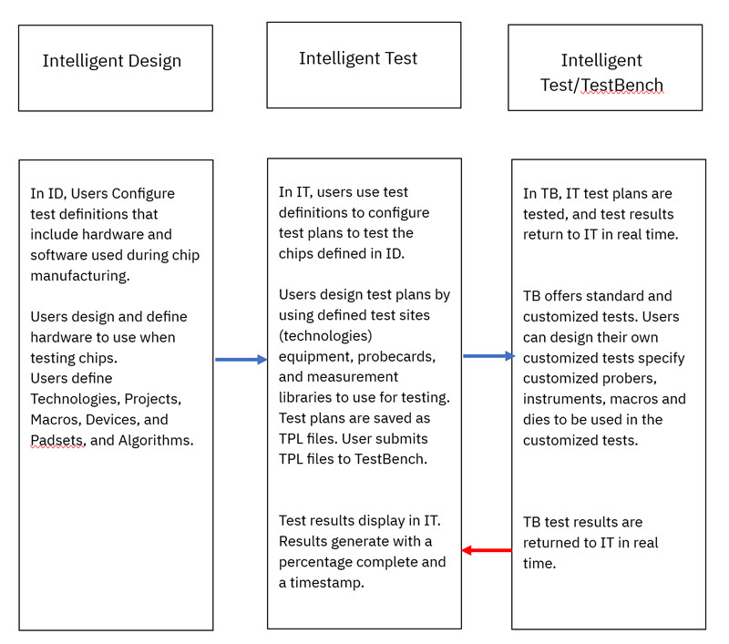

# Overview

This User Guide provides an introduction to the Intelligent Design \(ID\) application that processes, enhances, and streamlines the manufacture of semiconductor chips. ID's two companion modules are Intelligent Test \(IT\) and TestBench \(TB\). The IT module provides testers with the tools to define **Test Definitions** and **Test Plans**. The TB module provides testers with tools to customize each test plan and provides an execution platform that returns test results to IT in real time as test plans execute.

The following diagram demonstrates the workflow of the ID, IT, and TB application modules.

-   Intelligent Design Users configure Test Definitons in ID.
-   Intelligent Test Users use the Test Definitions to create Test Plans \(TPL files\) and send the plans to TestBench to be executed.
-   TestBench receives and executes the Tests Plans and returns the test results to IT in real time.

This User Guide includes general and configuration information about the ID application and its companion modules.

-   Access requirements
-   General navigation elements
-   User roles
-   Creating and editing the following entities
    -   Technologies
    -   Projects
    -   Macros
    -   Devices
    -   Pads and Padsets
-   Intelligent Test
    -   Test Definition
    -   Test Plan
-   Post Test Calculation
-   TestBench
-   Glossary of Terms

-   **[Access Requirements](../id_docs/access_requirements.md)**  
Before a user can gain access to the Intelligent Design \(ID\) App, a user must fulfill the following conditions:
-   **[Logging Into the ID Application](../id_docs/logging_into_id.md)**  

-   **[Notifications in Intelligent Design and Intelligent Test](../id_docs/notifications_in_intelligent_design_and_intelligent_test.md)**  
Intelligent Design and its companion module,Intelligent Test, provide real-time in-App and email notifications. In-App notifications within each application are application specific and display within their respective applications. Users can access the notifications panel within Intelligent Design and Intelligent Test.

