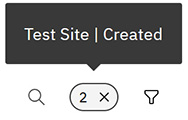

# Tables

In the Intelligent Design application, tables are used to present data and results uniformly.

Click a column heading to sort the table information by that column value or to toggle between ascending and descending order.

The following table outlines the functions of each of the icons in the menu bar.

|Icon Images|Description|
|-----------|-----------|
||Clicking the **Filter** icon opens the Data Filter modal. Select the filter options, and then click **Apply**. A numerical icon appears on the table. Hover over the numeric icon to view active filters. Click **X** to clear all filters. 

|
||Click the **Search** icon to search within the currently selected table.

 [Wildcard searching](wildcard_search.md) is supported in tables. In specific tables, where you can select multiple parameters, currently the tables for editing specifications and for selecting input parameters for calculations, adding **+** to the end of the search string selects all of the parameters which match the search string.

 Searches in Intelligent Design use Fuzzy Search, a powerful, and flexible mechanism that is designed to handle imprecise or partially specified queries. Users can search all tables \(Project, Macro, Device, Padsets, Pads, and their Aspects and attributes\), even if they enter partial terms, misspellings, or variations. Unlike traditional exact-match searches, Fuzzy Search uses algorithms that consider:

-   **Similarity Scoring**

Matches based on closeness of terms

-   **Phonetic Matching**

Recognizes sound-alike terms

-   **Contextual Relevance**

Understands intent and context

all of which help to ensure accurate and comprehensive results, even with imperfect input.

|
||Click the **Favorite** icon in any row to add a Project to your Favorites list.|

**Parent topic:**[Application elements](../id_docs/id_navigation.md)

