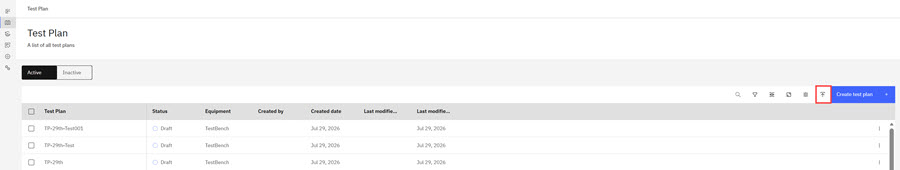
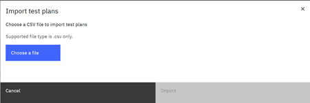
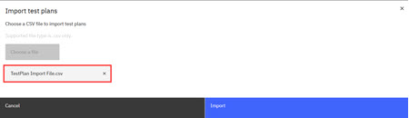
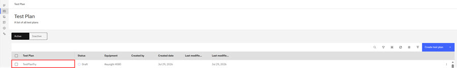

# Importing Test Plans

You can import Test Plans by using a properly formatted .csv file that contains the required Test Plan fields.

To navigate to the Test Plan page:

-   From the Intelligent Design app, click the **Switcher** icon and select **Intelligent Test**. The Test Plan page opens.

**Note:** Only Test Engineer Administrators and Testers can create, edit, delete, export, import, upload, or archive Test Plans.

**Note:** Users who are on teams that are assigned to the project that is referenced in a Test Plan are the only ones who can view, edit, delete, export, import, or archive the Test Plan.

1.  On the Test Plan page, click the **Import** symbol in the menu bar.

    

2.  The Import Notification displays.
3.  Click **Choose a File** on the Import notification.

    

4.  Files that are used for Test Plan import must be properly formatted as a .csv file that contains the required Test Plan fields. Required Test Plan fields are listed here.
    -   TestPlanName
    -   TestPlanDescription
    -   Project
    -   Technology
    -   EquipmentType
    -   Probe
    -   MeasurementLibrary
    -   Pad Dimension
    -   Pad Pitch X
    -   Pad Pitch Y
    -   Archived
    -   Test Level
    -   Testing Side
    -   Algorithm
    -   Wafer Definition
    -   DieMap
    -   MacroName
    -   DeviceName
    -   PNP
    -   InputParams
    -   OutputParams
    -   DeviceParams
    -   Test Definition Name
    -   Test Definition Device Code Pattern
5.  Browse to the properly formatted .csv file for the Test Plan and click **Open**.

6.  The file is uploaded and now displays in the Import Notification.

    

7.  Click **Import**. The Imported Test Plan is now displays in the list of Test Plans.

    

**Parent topic:**[Test Plan](../id_docs/it_test_plan_intro.md)

