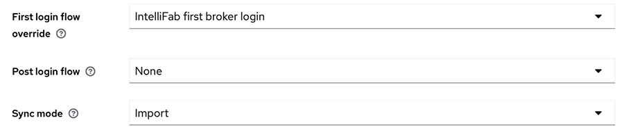

# Configuring essential login flow setting on Keycloak

In order to avoid user database differences between the user manager and Keycloak instance backing the user manager, confirm the following configuration is done for SSO identity provider properly.

1.  On the Keycloak Admin UI, select the target realm.

2.  Click **Identify providers**.

3.  Click **IBM w3id SSO**, or any other third party identity provider configuration.

4.  Select **Settings** \> **Advanced settings**.

5.  Set the **First login flow override** option to **IntelliFab first broker login**.

    

**Parent topic:**[User definition](../../id_docs/installation/data_setup2_user_def.md)

