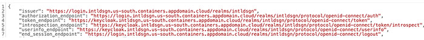
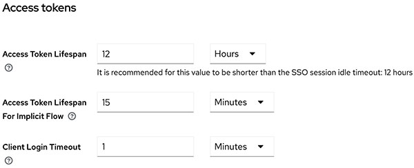
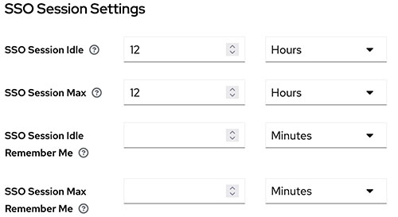

# ConfigMap setup

Before you begin, ensure the following tool addresses are provided.

|Tool name|URL|
|---------|---|
|Keycloak Admin Console| |
|ID Admin Console| |
|Backend Swagger \(unified portal\)| |
|OpenShift console| |

## ConfigMap and Secrets setup as Environmental variables

The front end application relies on the following environmental variables, statically loaded in the application startup.

|Environmental variable name

 

 Purpose

|Default value if omitted

 Type: string

|Actual value \(RIS3 test\)|
|**KEYCLOAK\_CLIENT\_ID**

 

 Keycloak Client ID for frontend

|N/A|id-application-client \(base-ui\)

 intellifab-test-application-client \(test-ui\)

|
|**KEYCLOAK\_CLIENT\_SECRET**

 **keycloak.baseFrontendSecret**

 **keycloak.testFrontendSecret**

 

 Keycloak Client Secret for frontend

|N/A \(as Secret\)|Copy generated value from Keycloak UI

 \(see Fig 1 below\)

|
|**KEYCLOAK\_ISSUER**

 

 Keycloak endpoint URL for frontend

|N/A|Copy generated value from Keycloak UI

 \(see Fig 2 below\)

|
|**NEXTAUTH\_URL**

 

 Frontend URL \(root URL\)

||https://test.intldsgn.us-south.containers.appdomain.cloud/|
|**NEXTAUTH\_SECRET**

 **nextAuth.secret**

 **Seed for encryption of JWT token**

||Generate by command

 “openssl rand -base64 32”

|
|**NEXT\_PUBLIC\_BASE\_URL**

 

 Frontend URL \(root URL\)

||https://test.intldsgn.us-south.containers.appdomain.cloud/|
|**ID\_CONFIG\_URL**

 

 Config manager endpoint URL of getServiceRouteInfo \(internal, http\)

|||
|**ID\_CONFIG\_PROFILE**||UAT|
|**ID\_CONFIG\_LABEL**||“1.0”|
|**ID\_CONFIG\_EXTERNAL**|N/A|false|
|**ID\_BT\_MAXAGE**

 Bearer token period in minutes \(sync with Keycloak setting\)

|“5”|“720”

 

 Copy generated value from Keycloak UI

 \(see Fig 3 below\)

|
|**NODE\_TLS\_REJECT\_UNAUTHORIZED**|N/A|0|
|**NEXT\_PUBLIC\_ID\_TP\_MAX\_DUP**| |5|

The way to assign environmental variables in the runtime environment depends on underlying system infrastructure. For example, if RedHat OpenShift is adopted, then ConfigMap and Secrets definition for runtime Pods is assumed.

Navigate to **Realm settings** \> **Endpoints**, open “OpenID Endpoint Configuration” link, then copy the value of “issuer” \(the first item\).

Navigate to **Realm settings** \> **Tokens** \> **Access tokens** \> **Access Token Lifespan**.

Apply the same value to SSO session: **Realm settings** \> **Sessions** \> **SSO Session Settings**.

