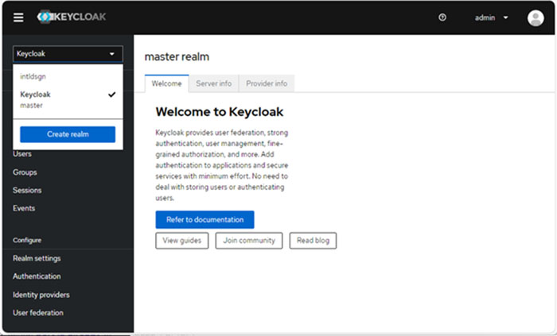

# Creating Realm

|\(A\) Realm name|\{Realm name for Intelligent Design Service\}|

1.  Login to the Keycloak admin console.

2.  In the Master drop-down menu, click **Create realm**.

    

3.  Provide realm name for Intelligent Design service, and click **Create**.

**Parent topic:**[Configuring Realm of keycloak - Manual](../../id_docs/installation/config_realm_keycloak_manual.md)

