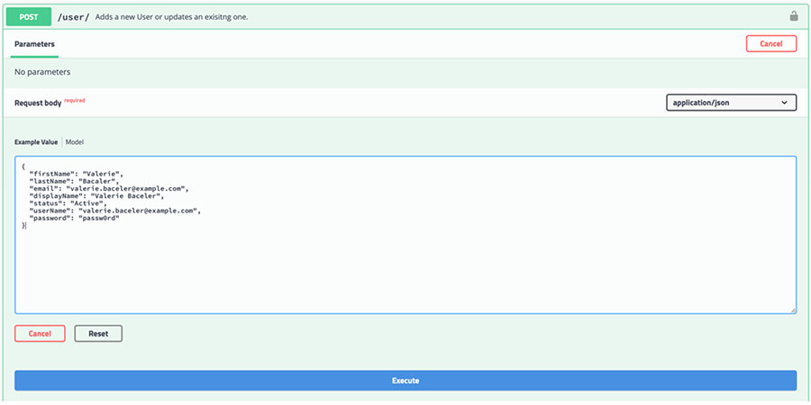
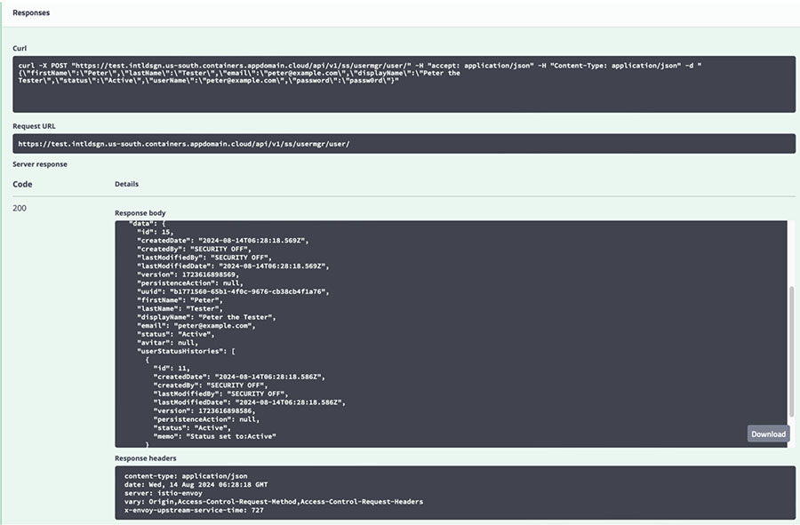

# Creating a user and assigning to a role

The following procedure illustrates how to setup fictitious users with Swagger, using sample emails with a common email domain like `@example.com`.

**Note:** W3id users \(IBM w3id users with email domains such as `@xx.ibm.com` and `@ibm.com`\) are not mentioned in this document.

|\(A\) `firstName`|\(B\) `lastName`|\(C\) `email`|\(D\) `displayName`|\(E\) `Password`|\(F\) `Role`|
|-----------------|----------------|-------------|-------------------|----------------|------------|
|Valerie|Bacaler|valerie.baceler@example.com|Valerie Bacaler|passw0rd|Project Administrator|
|Alam|Liu|alam.liu@example.com|Alam Liu|passw0rd|Macro Owner|
|Mantias|Cavvale|mantias.cavvale@example.com|Mantias Cavvale|passw0rd|Designer|
|Peter|Tester|peter@example.com|Peter the Tester|passw0rd|Tester|
|Samuel|Schuckert|samuel.schuckert@example.com|Samuel Schuckert|passw0rd|No role|

1.  Access the swagger interface of **User Manager** on the target system.

2.  Expand `user-controller`.

3.  Expand the `POST/user/` section.

4.  Click **Try it out**.

5.  Fill in the `Request body` text area with a JSON data.

    ```
    {
     "firstName": "(A)",
     "lastName": "(B)",
     "email": "(C)",
     "displayName": "(D) ",
     "status": "Active",
     "userName": "(C) ",
     "password": "(E)"
    }
    ```

    

6.  Click **Execute**.

    Ensure that the Response has status code 200 and body content includes the data you just posted. Status code other values than 200 indicates some error.

    


[Assign users to a group](assign_user_to_group.md).

**Parent topic:**[User definition](../../id_docs/installation/data_setup2_user_def.md)

