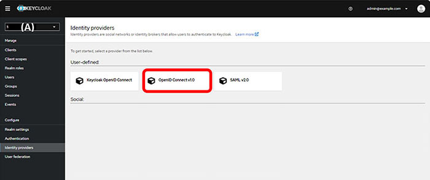
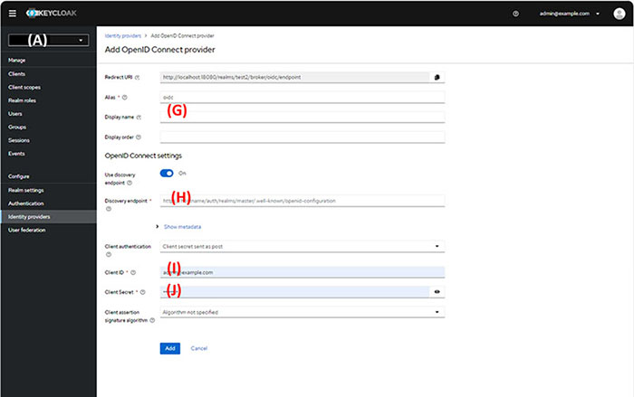
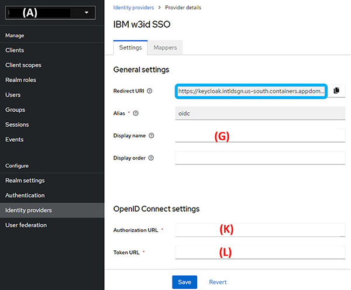
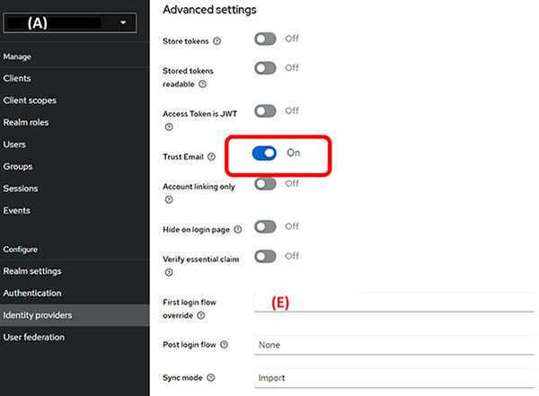

# Defining Identity providers

1.  On the defined identity provider, create SSO Client and prepare Client ID \(I\), Client Secret \(J\) and Discovery Endpoint \(H\).

2.  From the **Created Realm** drop-down menu, select **Identity providers**.

    |\(G\) Display name|\{Name of Identity Provider\}|
    |\(H\) Discovery Endpoint|\{Discovery Endpoint provided by Identity Provider\}|
    |\(I\) Client ID|\{Client ID provided by Identity Provider\}|
    |\(J\) Client Secret|\{Client Secret provided by Identity Provider\}|

3.  Click **OpenID Connect v1.0**.

    

4.  Set Display name \(G\) to Redirect URI and Discovery Endpoint, set \(H\) to Display name, then click **Add**.

    

5.  On the Identity provider page, click the created identity provider name.

6.  On the defined identity provider, configure the **Authorization URL** \(K\) and **Token URL** \(L\) by providing the **Redirect URI**.

    

7.  Set the **Authorization URL** \(K\) and the **Token URL** \(L\).

8.  Turn on **Trust Email**, set the **First login flow override**, and Click **Save**.

    

**Parent topic:**[Configuring Realm of keycloak - Manual](../../id_docs/installation/config_realm_keycloak_manual.md)

