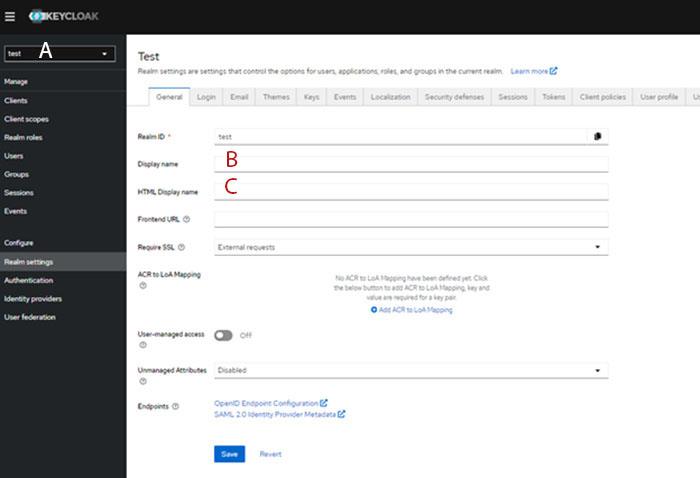

# Defining Realm settings

1.  Select the **Created Realm** drop-down menu, and click **Realm settings**.

    General Tab:

    |Key|Value|
    |\(B\) Display name|\{Display name for Intelligent Design Realm\}|
    |\(C\) Html Display name|<div\><span\>\{Display name for Intelligent Design Realm\}</span\></div\>|

2.  Set the **Display name**, and the **HTML Display name**, then click **Save**.

    

3.  On the **Themes** tab, set **Login Theme** and **Email Theme** to **intellfab-dark**, and click **Save**.

**Parent topic:**[Configuring Realm of keycloak - Manual](../../id_docs/installation/config_realm_keycloak_manual.md)

