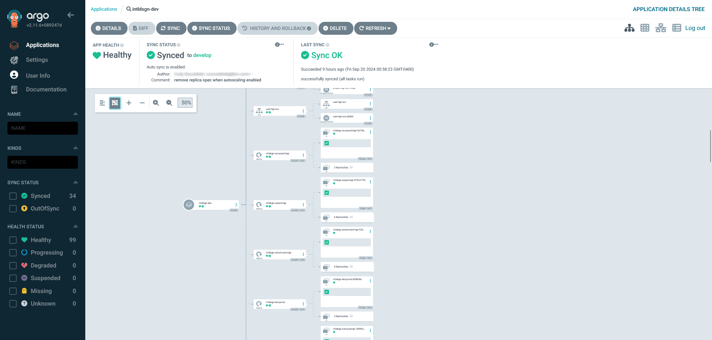

# Installing with ArgoCD

In order to use the Helm chart with ArgoCD, the chart must be stored in an external repository that is either OCI compatible or stored in a version control platform such as git.

To customize the ID application using ArgoCD you can either:

-   Directly set Chart/values overrides within the ArgoCD Application resource.
-   Reference an external values file stored in version control, similar to the manual Helm installation.

**Tip:** To use an external values file stored in version control, customize the provided Helm chart values file to fit your own environment. See the [Helm chart reference page](../reference/id_ref_helm_values.md) for more information. Check this into your version control system of choice, accessible by ArgoCD.

1.  In the namespace where ArgoCD is installed, create an Application resource using the following template:

    `intldsgn.yaml`

    ```
    apiVersion: argoproj.io/v1alpha1
     kind: Application
     metadata:
       name: intldsgn
       namespace: <namespace of ArgoCD>
     spec:
       destination:
           namespace: <target namespace>
           server: https://kubernetes.default.svc
       project: <ArgoCD Project>
       sources:
       - helm:
           valueFiles:
           - $values/values.yaml
           path: .
           repoURL: <a - Helm chart repo>
           targetRevision: <b>
       - ref: values
           repoURL: <c - values repo>
           targetRevision: <d>
    ```

    1.  URL to the repository containing your customized values file
    2.  If you are using a branch other than master/main, specify it here
    3.  URL to the repository containing the Helm chart
    4.  If Helm chart is stored in version control, branch to reference
    In the ArgoCD web interface, this creates a new application. Syncing the application will create the necessary resources required to run the Intelligent Design application.


