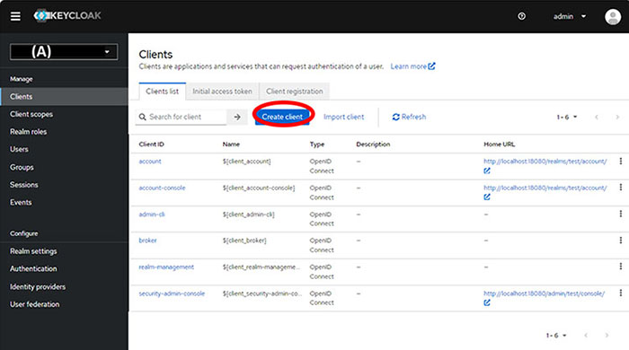

# Adding a ClientID

1.  From the Created Realm drop-down menu, select **Clients**.

2.  On the **Clients list** tab, click **Create client**.

    

3.  In General settings, set the **ClientID**, **Name**, and **Description**, then click **Next**.

4.  In Capability config, turn on **Client Authentication** and **Authorization**, then click **Next**.

5.  In Login settings, enter the following information:

    -   **Root URL**
    -   **Home URL**
    -   **Valid redirect URIs**
    -   **Valid post logout redirect URIs**
    -   **Web origins**
6.  Click **Save**.

[Add a Client credential](kc_add_client_cred.md)

**Parent topic:**[Creating a ClientID for ID applications](../../id_docs/installation/create_client_id.md)

