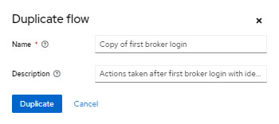
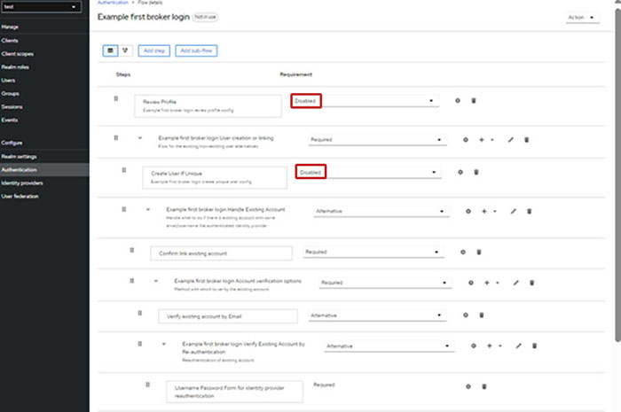

# Define Authentication

1.  Select the **Created Realm** drop-down menu, and click **Authentication**.

2.  Click the first broker login to open it.

3.  Click **Action** \> **Duplicate**.

4.  In the **Duplicate flow** window, type a **Name** and **Description**, then click **Duplicate**.

    

5.  Select **Disabled** for the **Review Profile** and **Create User Unique** fields.

    

**Parent topic:**[Configuring Realm of keycloak - Manual](../../id_docs/installation/config_realm_keycloak_manual.md)

