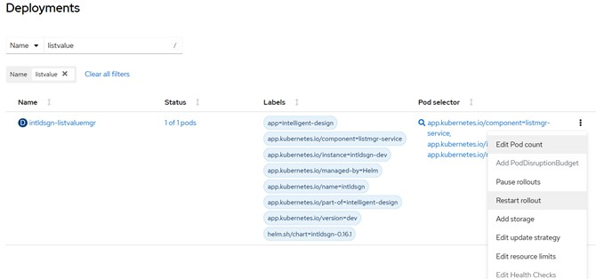

# Restart rollout for listvaluemgr deployment

1.  Log in to OpenShift and click **Deployments**.

2.  Search for `listvaluemgr` deployment.

3.  Click the **More** icon on \(three vertical dots\), and select **Restart rollout** to restart the service.

    

**Parent topic:**[Data deployment](../../id_docs/installation/data_deploy.md)

