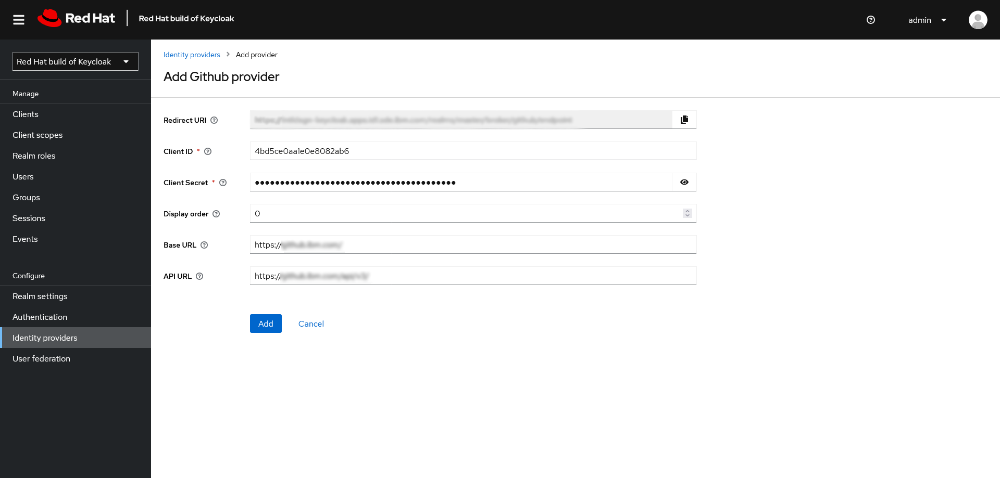
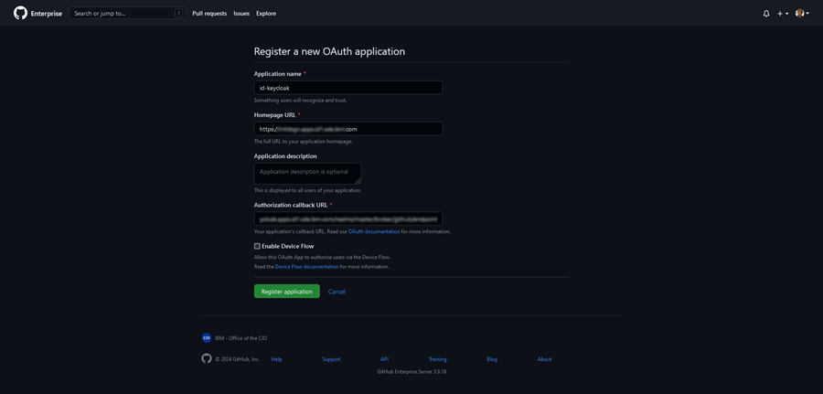

# Setting up GitHub as a Keycloak Identity Provider \(IDP\)

The following instructions explain how to set GitHub up as a Keycloak Identity Provider \(IDP\).

1.  Create the provider in Keycloak:

    1.  Logged into your realm as admin, navigate to **Configure** \> **Identity Providers** on the Keycloak admin console, and select **GitHub** as your identity provider.

        This generates a redirect URI used when creating the GitHub OAuth app.

    2.  Paste the **Client ID** and **Client Secret** in the respective fields.

    3.  Set the display order \(only if using multiple IDPs\), Base, and API URLs.

        If you are using on-premise GitHub Enterprise, these are the GHE URL and GHE URL with `/api/v3/` at the end, respectively.

    

2.  Navigate to your Organization settings in GitHub or GitHub Enterprise. Click OAuth Apps under **Developer Settings**.

3.  Create a new **OAuth App** by entering your app hostname under **Homepage URL**and paste in the previously obtained **Redirect URI** in the **Authorization callback URL** box.

    For example, with frontend URL **intldsgn-login.apps.id1.sde.ibm.com** and backend **intldsgn-keycloak.apps.id1.sde.ibm.com** the URL you would paste in GitHub is NOT the one presented in Keycloak but **intldsgn-login.apps.id1.sde.ibm.com**. Only if you are not using separate URLs will the displayed URL be correct.

    **Note:** If you are using a separate frontend and backend URL you **MUST** change the Redirect URL hostname to use `your _login_ URL`, rather than `_backend_ URL`.

    

    Copy the Client ID and generate a client secret, adding both to the provider in the Keycloak admin console.

-   **[Testing Authentication](../../id_docs/installation/testing_authentication.md)**  
This procedure shows users how to test authentication.

