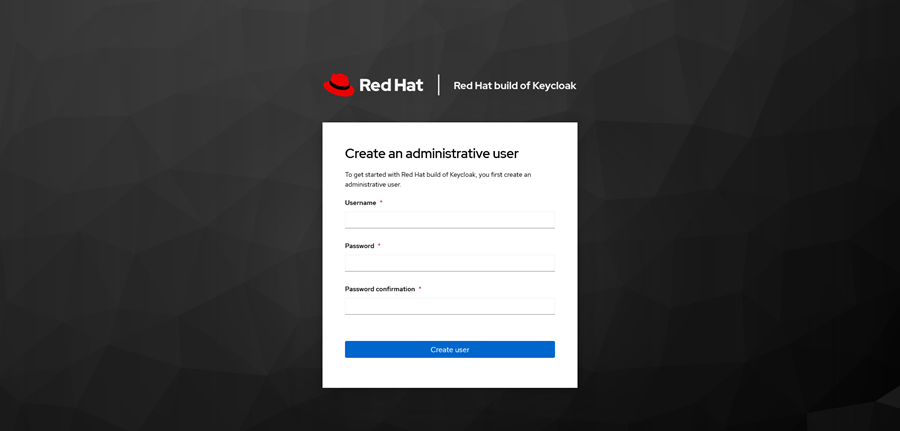

# Setting up ID Customized Keycloak

Setting up an ID Customized Keycloack is outlined in this overview.

Setting up the ID Customized Keycloak requires that you complete setting up the following environments.

-   External PostgreSQL database server
-   Red Hat OpenShift project/namespace and namespace-level admin privileges

1.  Issue the following commands from within a Postgres session to create a new database for keycloak.

    ```
    CREATE USER keycloak WITH PASSWORD '<password>';
    CREATE DATABASE keycloak_db ENCODING 'UTF-8' OWNER 'keycloak';
    ```

2.  Create the required resources that the deployment depends on, including the ConfigMap, Secrets, Service, and VirtualService.

    |Resource|Description|
    |--------|-----------|
    |ConfigMapSecret|Specifies the front and backend hostnames for the keycloak instances. It is preferred to use your FQDN.|
    |Secret|Contains the database connection string, username, and password|
    |TLS Secret|An empty secret is used to request a service certificate from the Red Hat OpenShift certificate provisioner|
    |Service|Keycloak front end and cluster \(discovery\) services|
    |VirtualService|Used if Istio / Service Mesh is enabled to expose the Keycloak instance. The Virtual Service also facilitates session stickiness for clustered Keycloak deployments that are running multiple pods.|
    | | |

    **configmap.yaml**

    ```
    kind: ConfigMap
     apiVersion: v1
     metadata:
       name: intellifab-keycloak
       namespace: intldsgn-common
     data:
       KC_HOSTNAME: <keycloak-login hostname>
       KC_HOSTNAME_ADMIN: <keycloak backend hostname>
    ```

    **secret.yaml**

    ```
    kind: Secret
     apiVersion: v1
     metadata:
       name: keycloak-tls-certificates
       namespace: intldsgn-common
     data:
       KC_DB_URL: <base64 connection string>
       KC_DB_USERNAME: <base64 username>
       KC_DB_PASSWORD: <base64 password>
     type: kubernetes.io/tls
    ```

    This is a connection string example. ‘jdbc:postgresql://<db\_url\>:5432/keycloak\_db’

3.  Deploy the Keycloak service

    ```
    oc apply -f configmap.yaml secret.yaml keycloak-tls-certificates.yaml service.yaml virtualservice.yaml
    oc apply -f deployment.yaml
    ```

4.  Set Up the Initial Keycloak User

    The initial administrator user can be created by connecting to one of the pods or to the service as localhost. To do create an admin user in Red Hat OpenShift, use the Red Hat OpenShift Client to port forward to the Keycloak service and connect to port 8443 on your local workstation.

    ```
    oc port-forward svc/keycloak-service 8443
    ```

    

    After creating the admin user, change back to using the regular \(backend\) URL specified earlier in the configmap.


