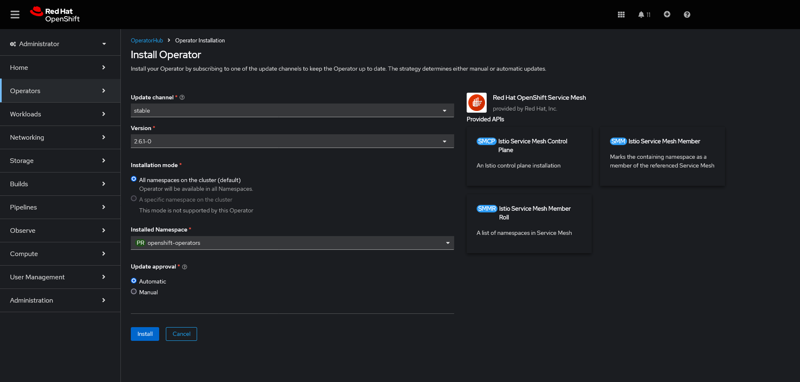

# Setting up ID with OpenShift Service Mesh \(lstio\)

The Intelligent Design application depends on Istio / Red Hat Openshift Service Mesh to secure communication between the various microservices and dependent resources such as Apache Kafka, the PostgreSQL database, and Keycloak \(if running on-cluster\).

Either RHOSP \(Red Hat Openshift Service Mesh\) or the upstream Istio project can be used. RHOSP can be installed in a single-tenancy or multi-tenancy mode. The following instructions provide a general guide to deploy RHOSP for the ID application in multi-tenancy mode.

1.  Install the prerequisite operators.

    Red Hat Openshift Service Mesh requires the Red Hat Openshift distributed tracing platform operator to be installed in order to properly function. The latest version should be installed from OperatorHub into the default recommended namespace \(Installation mode: All namespaces, Installed namespace: openshift-distributed-tracing\).

    If you would like a dashboard, the Kiali operator should also be installed. Install the Kiali Operator from RedHat via the OperatorHub. Again, use the default installation options \(Installation mode: All namespaces, Installed namespace: openshift-operators\).

2.  Install the service mesh operator.

    Install the Red Hat OpenShift Service Mesh operator from OperatorHub and follow the default recommendations for the mode and namespace \(Installation mode: All namespaces, Installed namespace: openshift-operators\) or install it into your own, dedicated namespace.

    

3.  Create the Service Mesh.

    Use either a new, dedicated namespace for the service mesh components or use the one created for the operator installation \(if custom - don’t set up the service mesh components in the default openshift-operators namespace.\)

    Create a new instance of Istio - the ServiceMeshControlPlane

    `service-mesh.yaml`

    ```
    apiVersion: maistra.io/v2
    kind: ServiceMeshControlPlane
    metadata:
      name: intldsgn-mesh
      namespace: intldsgn-istio
    spec:
      security:
        controlPlane:
          mtls: true
        dataPlane:
          mtls: true
      tracing:
        type: Jaeger
        sampling: 10000
      gateways:
        openshiftRoute:
          enabled: true
      policy:
        type: Istiod
      addons:
        grafana:
          enabled: false
          jaeger:
            install:
              storage:
                type: Memory
        kiali:
          enabled: true
        prometheus:
          enabled: true
        telemetry:
          type: Istiod
          version: v2.5
        mode: MultiTenant
    ```

    Once the SMCP and all child resources are created, you can view the newly created routes via the command line or in the **Networking** \> **Routes** section of the OCP Console. Navigating to the Kiali route will take you to the mesh control panel.

4.  Add namespaces and service mesh members.

    In order to use the service mesh you must add any namespaces which run workloads that should be included in the mesh to a ServiceMeshMemberRoll. In the namespace with the ServiceMeshControlPlane, create a ServiceMeshMemberRoll resource. The following example adds the “intldsgn-dev” and “intldsgn-test” namespaces to the mesh. Substitute these names with your own.

    `member-roll.yaml`

    ```
    apiVersion: maistra.io/v1
    kind: ServiceMeshMemberRoll
    metadata:
      name: default
      namespace: intldsgn-istio
    spec:
      members:
        - intldsgn-dev
        - intldsgn-test
    ```

5.  Create the application gateways.

    When the service mesh option is enabled, the ID Helm chart will create virtual services to expose the frontend and API endpoints of the ID application. This requires an Istio gateway to be set up prior to use. You can either create the gateway from the Kiali dashboard, or via YAML as specified below.

    `intldsgn-gw.yaml`

    ```
    kind: Gateway
    apiVersion: networking.istio.io/v1beta1
    metadata:
      name: intldsgn-apps-gw
      namespace: intldsgn-istio
    spec:
      servers:
        - port:
            number: 80
            protocol: HTTP2
            name: http2
          hosts:
            - intldsgn.apps.id1.sde.ibm.com
            - intldsgn-login.apps.id1.sde.ibm.com
            - intldsgn-keycloak.apps.id1.sde.ibm.com
          tls:
            httpsRedirect: true
        - port:
            number: 443
            protocol: HTTPS
            name: https
          hosts:
            - intldsgn.apps.id1.sde.ibm.com
            - intldsgn-login.apps.id1.sde.ibm.com
            - intldsgn-keycloak.apps.id1.sde.ibm.com
          tls:
            mode: SIMPLE
            credentialName: id1-route-certificate
      selector:
        istio: ingressgateway
    ```

    **Note:** You must substitute the hosts with your own hostname that you indend to use. These values must correspond to the values you provide in the Helm chart. To secure incoming external traffic, you must create a secret of type `kubernetes.io/tls`. If using the default `*.apps` domain, you can copy the ingress certificate secret from the openshift-ingress namespace. Istio / ServiceMesh and the Helm chart will then take care of creating and configuring the necessary routes to access the Intelligent Design application from outside of the cluster.


