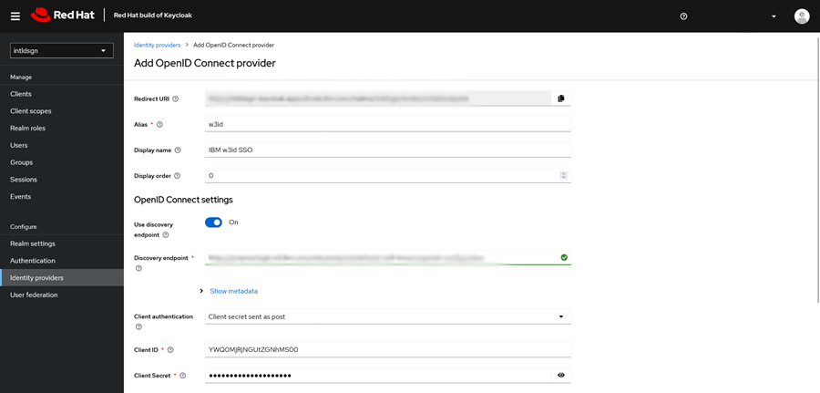

# Setting up IBM w3id \(OIDC\) as a Keycloak Identity Provider \(IDP\)

Use this procedure to Create the Provider in Keycloak.

1.  Log in to your realm as an admin and navigate to **Configure** \> **Identity Providers** in the Keycloak admin console. Select **OpenID Connect v1.0** as your identity provider. The system generates a redirect URI used to create the OIDC OAuth app.

    

