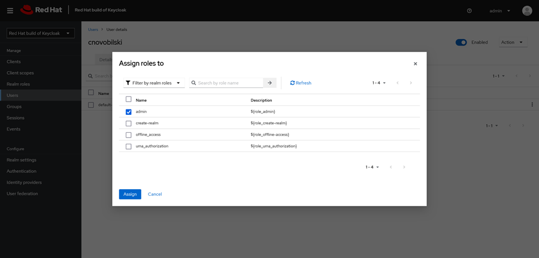

# Testing Authentication

This procedure shows users how to test authentication.

1.  Log out of the admin console and try logging in through your identity provider. If login is successful, you are promoted by GitHub to authorize Keycloak. After being redirected to Keycloak you might end up on a loading screen.

    If the intent of this IDP is to use it to link users who have administrative access to the console, you need to log back in as the initial admin user and add your new user \(generated by IDP login\) to the admin role.

    

    You should now be able to log into the admin console using the identity provider.

**Parent topic:**[Setting up GitHub as a Keycloak Identity Provider \(IDP\)](../../id_docs/installation/setting_up_gh_keycloak_idp.md)

