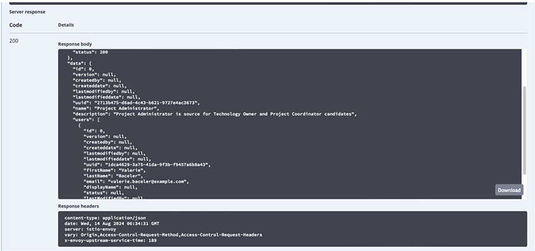

# Verifying the existence of prerequisite backend services and data

User manager – essential user permission

1.  Obtain a Bearer token.

    Example `curl` command to get access token:

    ```
    curl --request POST \                                                                                                                                                                     
      --url https://keycloak.intldsgn.us-south.containers.appdomain.cloud/realms/intldsgn-test/protocol/openid-connect/token \
      --header 'Content-Type: application/x-www-form-urlencoded' \
      --cookie ENVOY_SESSION_ID=%229ad7e0736adfddbf%22 \ 
      --data grant_type=password \
      --data client_id=id-application-authentication-client \
      --data username=samuel.schuckert@example.com \
      --data password=passw0rd \
      --data scope=openid \
      --data client_secret=R799ViT1VUMiIVOkTLtEBBCsq2IHt8qw \
    | jq '.access_token'
    
    ```

2.  Access the **User Manager** Swagger interface on the target system.

3.  Click **Authorize**.

4.  Paste your Bearer token \(without quotation marks\) into the **bearerAuth \(http, Bearer\)** field and click **Authorize**.

5.  Expand `user-controller`.

6.  Expand the `GET /user/permissions` section.

7.  Click **Try it out**.

8.  Click **Execute**.

9.  Find the **Response** section and **Response body** next to `Code 200`.

    


**Parent topic:**[Defining user permissions](../../id_docs/installation/user_permissions.md)

