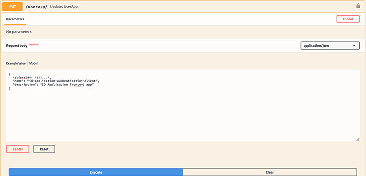
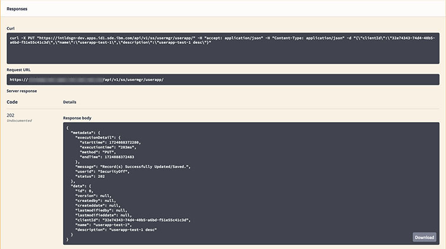

# Creating a UserApp entry

This document illustrates how to setup fictitious users, using sample emails with common email domain like `@example.com`.

1.  Access the **User Manager** Swagger interface on the target system.

2.  Expand `userapp-controller`.

3.  Expand the `PUT /userapp/` section. \(Not `POST`\)

4.  Click **Try it out**.

5.  Fill in Request body text area with JSON data.

    `"name"` values are:

    -   `“id-application-client”` for `base-ui`
    -   `“intellifab-test-application-client”` for `test-ui`
    ```
    {
      "clientId": "(keycloak uuid of clientId)",
      "name": "id-application-client",
      "description": "(keycloak clientId description)"
    }
    
    ```

    

6.  Click **Execute**.

7.  Ensure that the **Response**has status code 202, and body content includes the data you just posted. A status code other than 202 indicates an error.

    


**Parent topic:**[UserApp definition](../../id_docs/installation/userapp_definitions.md)

