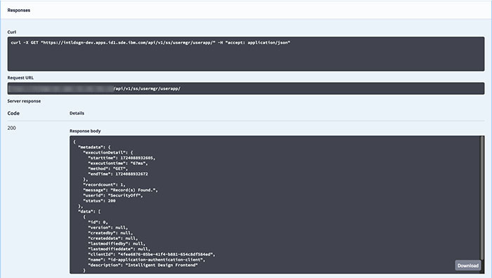

# Verifying the existence of prerequisite backend services and data

User manager – essential user permission

1.  Access the **User Manager** Swagger interface on the target system.

2.  Expand `userapp-controller`.

3.  Expand the `GET /userapp` section.

4.  Click **Try it out**.

5.  Click **Execute**.

6.  Find the **Response** section and **Response body** next to `Code 200`and ensure it contains an entity for `clientId "id-application-authentication-client"` in the `"data"` section. `Users` should contain the list of user assigned to the specified role.

    

**Parent topic:**[UserApp definition](../../id_docs/installation/userapp_definitions.md)

