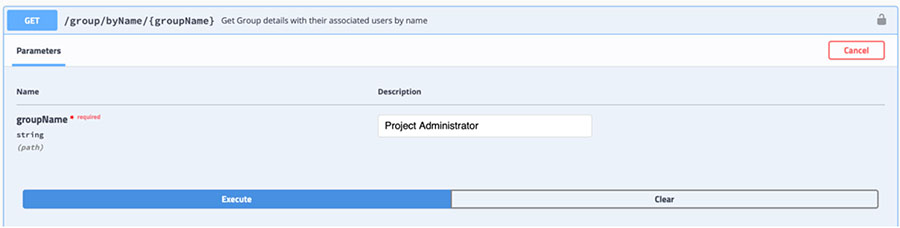

# Verifying prerequisite backend services and data

User manager – essential user definition and role assignment.

|\(A\) `firstName`|\(B\) `lastName`|\(C\) `email`|\(D\) `displayName`|\(E\) `Password`|\(F\) `Role`|
|-----------------|----------------|-------------|-------------------|----------------|------------|
|Valerie|Bacaler|valerie.baceler@example.com|Valerie Bacaler|passw0rd|Project Administrator|
|Alam|Liu|alam.liu@example.com|Alam Liu|passw0rd|Macro Owner|
|Mantias|Cavvale|mantias.cavvale@example.com|Mantias Cavvale|passw0rd|Designer|
|Peter|Tester|peter@example.com|Peter the Tester|passw0rd|Tester|
|Samuel|Schuckert|samuel.schuckert@example.com|Samuel Schuckert|passw0rd|No role|

1.  Access the **User Manager** Swagger interface on the target system.

2.  Expand `group-controller`.

3.  Expand the `GET/group/byName/\{groupName\}` section.

4.  Click **Try it out**.

5.  Repeat the following steps for `technologyOwnerGroupName`, `projectOwnerGroupName`, `macroOwnerGroupName`, and `macroDesignerGroupName`:

    1.  Type the `groupName` value assigned to `Role` \(F\) in the table above \(for example, Project Administrator\).

        

    2.  Click **Execute**.

    3.  Find the **Response** section and **Response body** next to `Code 200`.

        It contains one or more entries in the `data > users` part. `Users` should contain the list of user assigned to the specified role.

        

**Parent topic:**[User definition](../../id_docs/installation/data_setup2_user_def.md)

