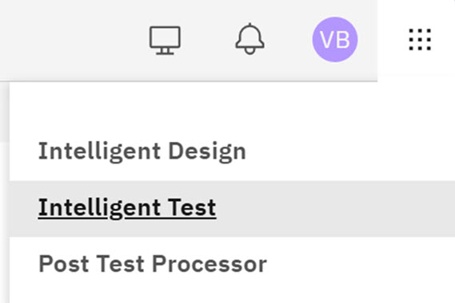

# Intelligent Test

Intelligent Test \(IT\) is a companion module within the ID application. The IT module provides testers with the tools to define **Test Definitions**, **Test Plans** and includes a TestBench \(TB\) tool integration. IT testers can send **Test Plans** to the TestBench tool for execution and view the test results in IT.

Intelligent Test is an application that allows any user to create a test plan for a targeted test system. It incorporates device data with customizable, pre-defined test definitions, allowing any user to automatically generate parametric electrical test programs for multiple Automatic Test Equipment systems, regardless of user knowledge of the system.

To access Intelligent Test from the Intelligent Design landing page, click the **Switcher** icon  and select **Intelligent Test**.

-   **[Test Definition](../id_docs/it_test_definition.md)**  
Test Definition is used to create a Test that would later be used in a Test Plan. Here you can specify the test and the details surrounding the test to be used in the Test Plan.
-   **[Test Plan](../id_docs/it_test_plan_intro.md)**  
Test Plan is used to create a TPL file to communicate to a testing device which devices and macros to run tests on and the order in which to run the tests. Test plan creation now requires ID user to specify macro test sides, **Frontside** or **Grindside**. Selecting **Frontside** means that macros marked as **Front** or **Both** are available for selection. Selecting **Grindside** only macros marked as **Both** are available for selection.
-   **[Test Bench](../id_docs/test_bench.md)**  
Test Bench is a new feature in Intelligent Test that integrates the TestBench tool test functions with Intelligent Test.
-   **[Variable management](../id_docs/tech_variables.md)**  
Intelligent Test supports the definition and management of variables that allow non‑constant values to be passed to the algorithm. These variables enable dynamic behavior based on technology or ILT device, reducing hard‑coded logic and improving reusability across projects.
-   **[Wafer Management](../id_docs/wafer_management.md)**  
Wafer Management allows Intelligent Test users to define wafer characteristics for a project, map die locations on that wafer, and map dies into named die maps.
-   **[Configuration Management](../id_docs/config_management.md)**  
Configuration Management is a centralized hub in IT for maintaining master data for core test entities. It enables users with appropriate roles to create, view, and manage Equipment, Measurement Libraries, Probes, and Assets.

