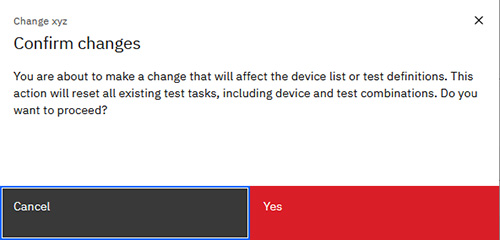

# Copying a Test Plan

You can copy any existing Test Plan on the Test Plan page, regardless of its status.

To navigate to the Test Plan page:

-   From the Intelligent Design app, click the **Switcher** icon and select **Intelligent Test**. The Test Plan page opens.

**Note:** Only Test Engineer Administrators and Testers can create, edit, delete, export, import, upload, or archive Test Plans.

**Note:** Users who are on teams that are assigned to the project that is referenced in a Test Plan are the only ones who can view, edit, delete, export, import, or archive the Test Plan.

1.  On the **Test Plan** page, select the **Options** icon next to a Test Plan, and click **Copy**.

2.  Type a unique **Name** for the new Test Plan.

3.  Modify any of the following attributes:

    -   **Description**
    -   **Technology**
    -   **Equipment**
    -   **Probe**
    -   **Measurement Library**
    -   **Algorithm**
    -   **Input Aspects**
    -   **Output Aspects**
    -   **Device Parameters**
    **Note:** If you update the **Configuration** section, you must confirm your changes. This action resets all existing test tasks, including device and test combinations.

    

4.  To add Devices to the Test Plan, follow the steps outlined in [Managing Devices in Test Plans](tesplandevices.md)

5.  Click **Create**.

    A Test Plan is created in **DRAFT** status.

6.  To create a TPL file, click **Generate TPL file**.

    The file is downloaded automatically.

    **Note:** After a TPL file is created, the Test Plan is no longer editable.

**Parent topic:**[Test Plan](../id_docs/it_test_plan_intro.md)

