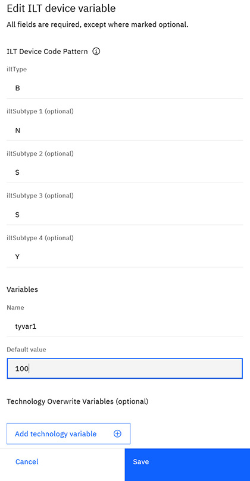

# Creating and editing ILT Device Variables

Only users with the Tester role can create and edit Variables.

1.  Click **Variable Management** in the navigational pane to open the Variable Management page.

    

2.  Select the ILT Device Variables tab, click **Create ILT device variable**, or select the **More** menu in the table row of the Variable you want to edit, and select **Edit**.

    

3.  Select an **iltType**.

4.  Select up to 4 **iltSubType**s you want to add.

5.  Type a **Name** for the Variable and type the **Default value**.

6.  To add a Technology Variable, click **Add technology variable**, select a **Technology**, and enter a **Value** for that Variable.

7.  Click **Create** or **Save**.

    

**Parent topic:**[Variable management](../id_docs/tech_variables.md)

