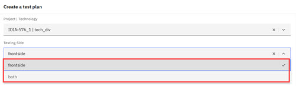
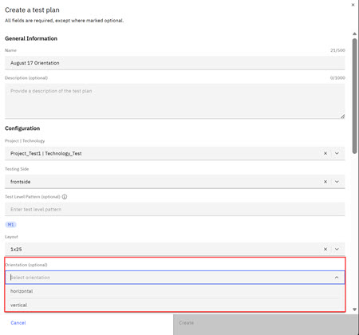

# Creating a Test Plan

You can create a Test Plan on the Test Plan page of the Intelligent Test app. Users cannot create or view test plans that include macros or devices that are restricted to other teams. If macro restrictions are updated, the changes are automatically refreshed. Test plan creation now requires ID user to specify macro test sides, **Frontside**, or **Grindside**. Selecting **Frontside** means that macros marked as **Front** or **Both** are available for selection. Selecting **Grindside** only macros marked as **Both** are available for selection.

To navigate to the Test Plan page:

-   From the Intelligent Design app, click the **Switcher** icon and select **Intelligent Test**. The Test Plan page opens.

**Note:** Only Test Engineer Administrators and Testers can create, edit, delete, export, import, upload, or archive Test Plans.

1.  On the **Test Plan** page, click **Create**. The Test Plan page opens.

2.  Type a unique **Name**.

3.  Type a **Description** for the Test Plan.

4.  Select a **Project/Technology** for this Test Plan.

    **Note:** Users who are on teams that are assigned to the project that is referenced in a Test Plan are the only ones who can view, edit, delete, export, import, or archive the Test Plan.

5.  Select a **Testing Side**.

    Selecting **Frontside** means that macros marked as **Front** or **Both** are available for selection. Select a Macro side.

    Selecting **Frontside** means that macros marked as **Front** or **Both** are available for selection.

    

6.  Select a **Layout** for this Test Plan.

7.  Select an **Orientation** for this Test Plan. Choices are **Blank**, **Horizontal**, or **Vertical**.

    

    **Note:** Selecting **Horizontal** causes the macro assignment table to list only macros whose orient aspect value is belongs to the Horizontal group, selecting **Vertical** causes the macro assignment table to list only macros whose orient aspect value is belongs to the Vertical group, and when the field is left blank no orientation filtering is applied.

8.  Select the **Pad Dimenstion** for this Test Plan.

9.  Select the **Pad Pitch X** for this Test Plan.

10. Select the **Pad Pitch Y** for this Test Plan.

11. Select the **Equipment** from the list.

12. Select a **Probe** from the list.

13. Select a **Measurement Library** from the list. Available Measurement Libraries change depending on the selected **Equipment**.

14. To add Devices to the Test Plan, follow the steps that are outlined in [Managing Devices in Test Plans](tesplandevices.md).

15. To mass assign Die Map values:

    1.  Select the check boxes next to the devices that you want to update.

    2.  Click **Assign Die Map** and select the wanted value.

16. To mass assign PNP Numbers:

    1.  Select the check boxes next to the devices that you want to update.

    2.  Click **Assign PNP** and enter the wanted value.

17. Click **Create**.

    A Test Plan is created in **DRAFT** status.

18. To create a TPL file, click **Generate TPL file**.

    The file is downloaded automatically.

    **Note:** After a TPL file is created, the Test Plan is no longer editable.

**Parent topic:**[Test Plan](../id_docs/it_test_plan_intro.md)

