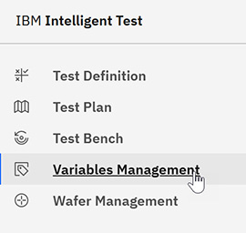
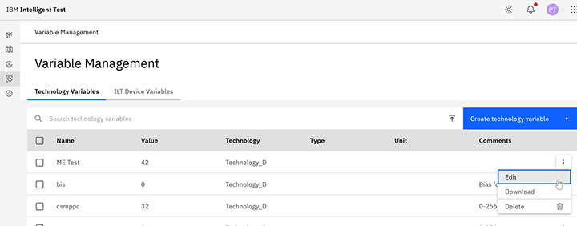
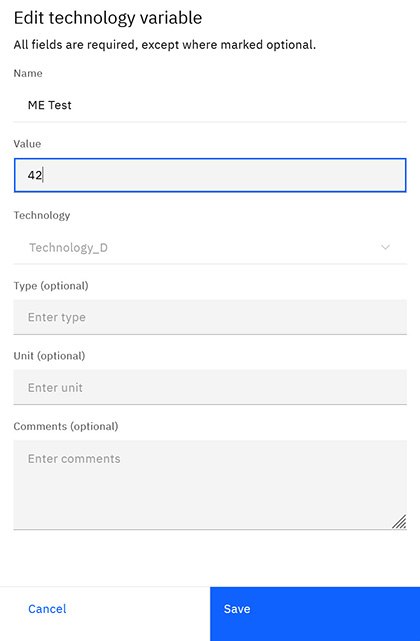

# Creating and editing Technology Variables

Only users with the Tester role can create and edit Variables.

1.  Click **Variable Management** in the navigational pane to open the Variable Management page.

    

2.  On the Technology Variables tab, click **Create technology variable** or select the **More** menu in the table row of the Variable you want to edit, and select **Edit**.

    

3.  Type a **Name** for the Variable and type the **Value**.

4.  Select one or more Technologies from the **Technology** list to use this Variable.

5.  Enter a **Type**, **Unit**, and any **Comments** you want to add.

6.  Click **Create** or **Save**.

    

**Parent topic:**[Variable management](../id_docs/tech_variables.md)

