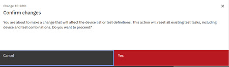

# Editing a Test Plan

You can edit an existing Test Plan on the Test Plan page of the Intelligent Test app. As with test plan creation, users cannot view or edit test plans that include macros or devices that are restricted to other teams. If macro restrictions are updated, the changes are automatically refreshed. Test plans now can contain **Frontside** and **Grindside** macros. Users can edit **Test Plans** and change macros within that Plan. When the macro testing sides are edited and updated, the system must **reapplies** filtering and **validates the edited macro selections** to ensure that the edited macros are compliant with the selected testing side.

**Note:** Only Test Engineer Administrators and Testers can create, edit, delete, export, import, upload, or archive Test Plans.

**Note:** Users who are on teams that are assigned to the project that is referenced in a Test Plan are the only ones who can view, edit, delete, export, import, or archive the Test Plan.

To navigate to the Test Plan page:

-   From the Intelligent Design app, click the **Switcher** icon and select **Intelligent Test**. The Test Plan page opens.

**Note:** Test Plans in **DRAFT** status are the only Test Plans that can be edited. After the status changes to **RELEASED**, the Test Plan is no longer editable. Test Engineer Administrators and Testers are the only ones who can create, edit, delete, or upload Test Plans.

1.  On the **Test Plan** page, select the Test Plan and click **Edit**.

    **Tip:** You can also click the Test Plan name to open the plan for editing.

2.  Type a unique **Name**.

3.  Type a **Description** for the Test Plan.

4.  Select a **Technology** for this Test Plan.

5.  Edit the **Testing Side**. As you make this change, the **Confirm Change** alert displays.

    

6.  Click **Yes** to confirm the **Testing Side** change.

7.  Select the **Equipment** from the list.

8.  Select a **Probe**from the list.

9.  Select a **Measurement Library** from the list.

10. Select a **Die Map**from the list.

11. Select a **Measurement Library**from the list.

12. To add Devices to the Test Plan, follow the steps that are outlined in [Managing Devices in Test Plans](tesplandevices.md)

13. Click **Save**.

14. To create a TPL file for this Test Plan, click the **Hamburger Menu** and select **Generate TPL file**.

**Parent topic:**[Test Plan](../id_docs/it_test_plan_intro.md)

