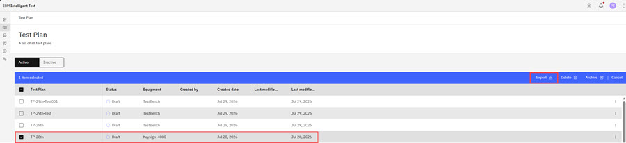

# Exporting Test Plans

You can export Test Plans on the Test Plan page to a .csv formatted file.

To navigate to the Test Plan page:

-   From the Intelligent Design app, click the **Switcher** icon and select **Intelligent Test**. The Test Plan page opens.

**Note:** Only Test Engineer Administrators and Testers can create, edit, delete, export, import, upload, or archive Test Plans.

**Note:** Users who are on teams that are assigned to the project that is referenced in a Test Plan are the only ones who can view, edit, delete, export, import, or archive the Test Plan.

1.  On the Test Plan page, select one or more Test Plans in the table, and click **Export**in the menu bar.

    

    The Test Plans are exported and saved to your Downloads folder in a .csv file that includes the following columns:

    -   TestPlanName
    -   TestPlanDescription
    -   Project
    -   Technology
    -   EquipmentType
    -   Probe
    -   MeasurementLibrary
    -   Pad Dimension
    -   Pad Pitch X
    -   Pad Pitch Y
    -   Archived
    -   Test Level
    -   Testing Side
    -   Algorithm
    -   Wafer Definition
    -   DieMap
    -   MacroName
    -   DeviceName
    -   PNP
    -   InputParams
    -   OutputParams
    -   DeviceParams
    -   Test Definition Name
    -   Test Definition Device Code Pattern
    **Tip:** You can modify this Test Plan .csv file offline and use it to [Upload Bulk Test Plans](upload_bulk_test_plans.md).

**Parent topic:**[Test Plan](../id_docs/it_test_plan_intro.md)

