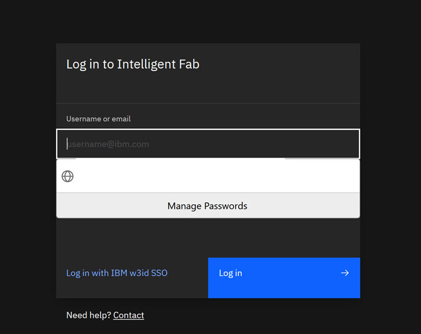

# Logging Into the ID Application

With access permission granted, you can log into the ID application.

1.  Browse to the ID Application.

2.  Enter your Credentials \(Username and Password\) and Click **Login**.

    The ID Application page opens.

    

    The ID Application identifies your user permission access, opens the appropriate Landing page.

**Parent topic:**[Overview](../id_docs/id_overview.md)

